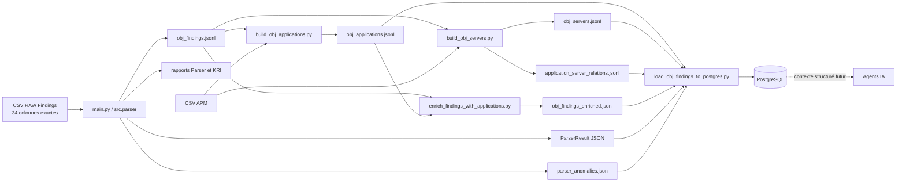
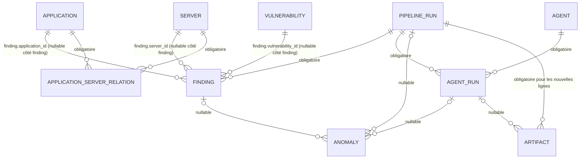
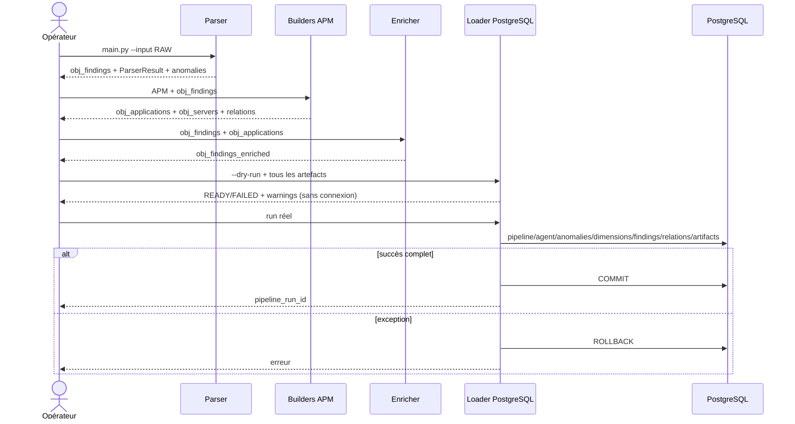
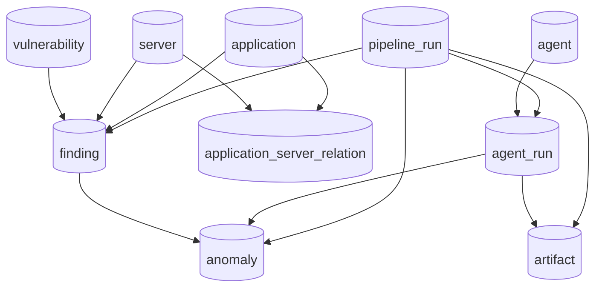
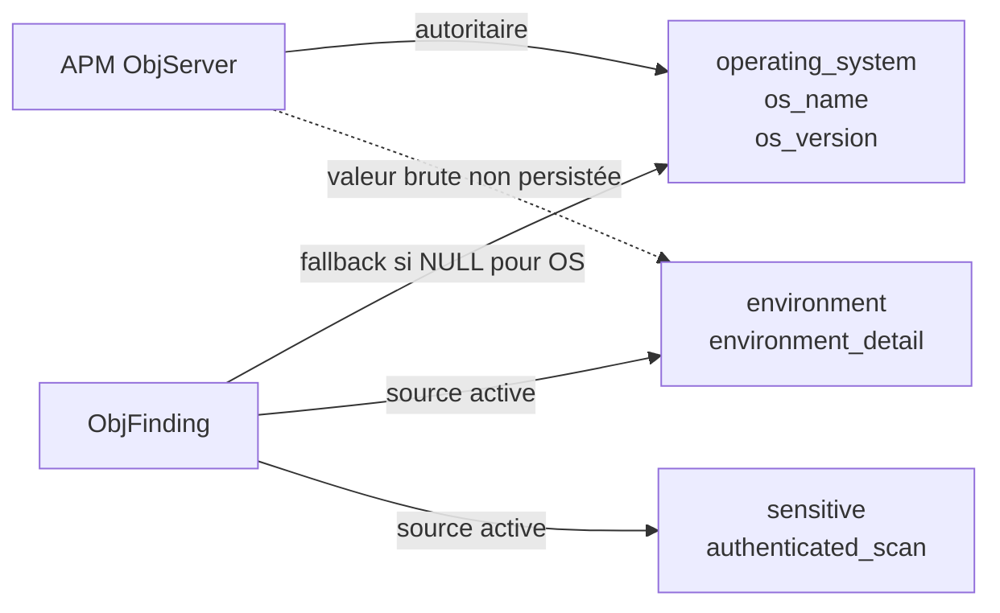

# Guide technique de passation — Data, Parser et PostgreSQL

> État documenté : implémentation présente dans le dépôt au 24 septembre 2026.
> En cas d'écart avec un ancien README, je prends le code et les scripts SQL actuels comme référence.
> Convention : `IMPLÉMENTÉ` décrit un comportement présent dans le code ; `FUTUR` décrit une cible non branchée ; `TO_VALIDATE` désigne une règle métier ouverte ; `NOT_DEFINED_IN_CURRENT_IMPLEMENTATION` désigne une information absente du projet.
> Toutes les commandes système de ce guide ciblent Windows PowerShell. Les blocs `sql` sont à exécuter dans `psql` ouvert depuis PowerShell ou dans le Query Tool de pgAdmin.

## Table des matières

1. [Objectif du document](#1-objectif-du-document)
2. [Vue d'ensemble du système](#2-vue-densemble-du-système)
3. [Architecture des données](#3-architecture-des-données)
4. [Modèle conceptuel, logique et physique](#4-modèle-conceptuel-logique-et-physique)
5. [Prérequis techniques](#5-prérequis-techniques)
6. [Installation PostgreSQL locale](#6-installation-postgresql-locale)
7. [Création de la base](#7-création-de-la-base)
8. [Création du schéma](#8-création-du-schéma)
9. [Configuration de la connexion Python](#9-configuration-de-la-connexion-python)
10. [Structure des données d'entrée](#10-structure-des-données-dentrée)
11. [Mapping RAW vers obj_finding](#11-mapping-raw-vers-obj_finding)
12. [Structure de obj_finding](#12-structure-de-obj_finding)
13. [Application et mapping APM](#13-application-et-mapping-apm)
14. [Déduplication Application](#14-déduplication-application)
15. [Mapping Server](#15-mapping-server)
16. [Mapping Vulnerability](#16-mapping-vulnerability)
17. [Mapping des objets vers PostgreSQL](#17-mapping-des-objets-vers-postgresql)
18. [Pipeline Run](#18-pipeline-run)
19. [Dry-run](#19-dry-run)
20. [Chargement PostgreSQL réel](#20-chargement-postgresql-réel)
21. [Transactions](#21-transactions)
22. [Vérification post-chargement](#22-vérification-post-chargement)
23. [Requêtes SQL utiles](#23-requêtes-sql-utiles)
24. [Relation Application–Server](#24-relation-applicationserver)
25. [Informations de remédiation](#25-informations-de-remédiation)
26. [KRI RAS 9](#26-kri-ras-9)
27. [Data Quality](#27-data-quality)
28. [Gestion des NULL](#28-gestion-des-null)
29. [source_payload et traçabilité](#29-source_payload-et-traçabilité)
30. [Index et performances](#30-index-et-performances)
31. [Utilisation avec pgAdmin](#31-utilisation-avec-pgadmin)
32. [ERD et visualisation](#32-erd-et-visualisation)
33. [Relancer le pipeline](#33-relancer-le-pipeline)
34. [Re-run et idempotence](#34-re-run-et-idempotence)
35. [Reset d'une base locale](#35-reset-dune-base-locale)
36. [Sauvegarde et restauration](#36-sauvegarde-et-restauration)
37. [Troubleshooting complet](#37-troubleshooting-complet)
38. [Sécurité](#38-sécurité)
39. [Intégration future avec les agents](#39-intégration-future-avec-les-agents)
40. [Checklist de mise en service locale](#40-checklist-de-mise-en-service-locale)
41. [Checklist de passation](#41-checklist-de-passation)
42. [Glossaire](#42-glossaire)
43. [Annexe A — Data Dictionary complet](#annexe-a--data-dictionary-complet)
44. [Annexe B — Mapping RAW vers obj_finding](#annexe-b--mapping-raw-vers-obj_finding)
45. [Annexe C — Mapping obj_finding vers PostgreSQL](#annexe-c--mapping-obj_finding-vers-postgresql)
46. [Annexe D — Mapping Application/APM](#annexe-d--mapping-applicationapm)
47. [Annexe E — SQL Query Cookbook](#annexe-e--sql-query-cookbook)
48. [Annexe F — Troubleshooting Matrix](#annexe-f--troubleshooting-matrix)
49. [Annexe G — Architecture diagrams](#annexe-g--architecture-diagrams)
50. [Annexe H — TO_VALIDATE et limites connues](#annexe-h--to_validate-et-limites-connues)

# 1. Objectif du document

J'ai regroupé dans ce document les éléments nécessaires pour reprendre la chaîne Data/Parser/PostgreSQL sans dépendre de connaissances orales. Le guide reflète l'état du dépôt à la date indiquée en tête de fichier.

La personne qui reprend le projet doit pouvoir :

- transformer le CSV RAW Findings en objets `Finding` ;
- construire les dimensions APM `ObjApplication` et `ObjServer` ;
- enrichir les findings avec les applications ;
- créer ou migrer le schéma PostgreSQL local ;
- valider les artefacts en `--dry-run`, puis effectuer un chargement transactionnel ;
- contrôler un `pipeline_run`, ses anomalies, ses relations et ses artefacts ;
- recalculer le KRI RAS 9 avec la règle réellement codée ;
- diagnostiquer les erreurs courantes et comprendre les limites actuelles.

Le périmètre couvre `main.py`, le Parser, les modèles Pydantic, les builders Application/Server, l'enrichissement, la persistance psycopg, les scripts SQL, le reporting, le Parser Agent/LangGraph et les tests associés.

Sont hors périmètre ou non définis : déploiement serveur, CI/CD, politique de rétention, ordonnanceur, sauvegarde automatisée, comptes PostgreSQL de production, schéma réseau, Power BI, règles d'un futur Analyst Agent et LLM en production. Leur état est `NOT_DEFINED_IN_CURRENT_IMPLEMENTATION` sauf mention contraire.

# 2. Vue d'ensemble du système

## 2.1 Flux réel



## 2.2 Responsabilités

| Composant | Responsabilité actuelle | Ne fait pas |
|---|---|---|
| `src/loaders/finding_loader.py` | Lit le CSV, impose 34 colonnes et leur ordre. | N'applique aucune règle métier. |
| `src/parser.py` | Nettoie, mappe, calcule dates/âge/SLA/overdue/sensibilité/KRI et produit anomalies/statistiques. | Ne se connecte pas à PostgreSQL. |
| `main.py` | CLI Parser et écriture des artefacts. | Ne reçoit pas de lookup APM ; l'enrichissement interne reste donc `SKIPPED_NO_SOURCE`. |
| `scripts/build_obj_applications.py` | Construit le référentiel Application APM limité aux AUID des findings. | Ne modifie pas les findings. |
| `scripts/build_obj_servers.py` | Construit les serveurs APM et les couples AUID–hostname. | Ne persiste rien en base. |
| `scripts/enrich_findings_with_applications.py` | Complète uniquement `application.trigram` et `application.name` vides. | N'écrase pas une valeur Finding différente. |
| `src/persistence/finding_mapper.py` | Traduit les objets JSON en dictionnaires relationnels. | Ne crée pas de connexion et ne décide pas la transaction. |
| `scripts/load_obj_findings_to_postgres.py` | Valide les artefacts, ouvre la connexion et orchestre une transaction complète. | Le `--dry-run` n'interroge pas PostgreSQL. |
| `src/persistence/postgres_repository.py` | Exécute du SQL paramétré, applique les règles d'upsert des dimensions. | N'est pas un ORM. |
| `parser_agent_main.py` / LangGraph | Encapsule le Parser et analyse certains warnings KRI. | N'appelle pas le loader PostgreSQL ; son statut PostgreSQL est encore codé `NOT_CONFIGURED`. |

# 3. Architecture des données

Le MPD actuel contient dix tables, dont la table de jonction `application_server_relation`.

| Table | Rôle | Clé primaire | Relations principales |
|---|---|---|---|
| `application` | Dimension Application canonique APM. | `application_id` | Référencée par `finding` et `application_server_relation`. |
| `server` | Dimension Server globale, canonique par hostname trimé et sensible à la casse. | `server_id` | Référencée par `finding` et `application_server_relation`. |
| `application_server_relation` | Couples Application–Server déclarés par APM. | `(application_id, server_id)` | Deux FK obligatoires. |
| `vulnerability` | Dimension vulnérabilité, généralement regroupée par CVE. | `vulnerability_id` | Référencée par `finding`. |
| `pipeline_run` | Traçabilité d'un chargement. | `pipeline_run_id` UUID | Parent de `finding`, `agent_run`, `anomaly`, `artifact`. |
| `agent` | Référentiel d'agents. | `agent_id` | Parent de `agent_run`. |
| `agent_run` | Exécution d'un agent dans un pipeline. | `agent_run_id` | Référence `pipeline_run` et `agent`; parent d'anomalies/artifacts. |
| `finding` | Fait de vulnérabilité pour un run. | `finding_id` | FK obligatoire vers le run, FK optionnelles vers les dimensions. |
| `anomaly` | Anomalie Parser ou loader. | `anomaly_id` | FK toutes optionnelles vers run, agent_run et finding. |
| `artifact` | Fichier audité avec chemin, hash et nombre d'enregistrements. | `artifact_id` | Run obligatoire ; agent_run optionnel mais cohérent avec le même run. |

Le dictionnaire colonne par colonne se trouve en [annexe A](#annexe-a--data-dictionary-complet). Le schéma ne crée pas de tables `remediation`, `environment` ou `owner` : ces informations sont actuellement des colonnes de `finding` ou `server`.

# 4. Modèle conceptuel, logique et physique

## 4.1 Niveaux

- Le **MCD** décrit les concepts métier indépendamment du stockage : une application, un serveur, une vulnérabilité, un finding et une exécution.
- Le **MLD** traduit ces concepts en relations, identifiants et cardinalités.
- Le **MPD** est le SQL PostgreSQL exact de `database/001_create_tables.sql`, complété par les migrations `003` et `004` et les index de `002`.

## 4.2 Relations physiques exactes



Cardinalités importantes :

- chaque `finding` appartient exactement à un `pipeline_run` ;
- un `finding` peut référencer zéro ou une application, zéro ou un serveur et zéro ou une vulnérabilité ;
- une dimension peut être référencée par zéro à plusieurs findings ;
- Application et Server ont une relation plusieurs-à-plusieurs **réellement matérialisée** par `application_server_relation` ;
- une seconde relation, observée pendant un run, peut être reconstruite via `finding.application_id` et `finding.server_id` ;
- il n'existe pas de colonne FK directe `application.server_id` ou `server.application_id`.

# 5. Prérequis techniques

| Prérequis | État exact |
|---|---|
| Python | Version non épinglée. La syntaxe `str | None` implique Python 3.10 ou supérieur. Version officiellement supportée : `TO_VALIDATE`. |
| Environnement virtuel | Recommandé ; `.venv/` est ignoré par Git. |
| Dépendances | `pandas>=3.0,<4`, `pydantic>=2.13,<3`, `pytest>=9,<10`, `langgraph>=1.0,<2`, `psycopg[binary]>=3.2,<4`. |
| PostgreSQL | Version non épinglée : `NOT_DEFINED_IN_CURRENT_IMPLEMENTATION`. |
| `psql` / pgAdmin | Outils d'exploitation ; aucune version n'est imposée dans le dépôt. |
| OS | Les commandes d'exploitation de ce guide ciblent Windows PowerShell. La matrice des OS officiellement supportés est `NOT_DEFINED_IN_CURRENT_IMPLEMENTATION`. |
| Droits | Créer une base, créer tables/index/contraintes, puis `SELECT/INSERT/UPDATE` sur les tables et usage des séquences. Le rôle exact de production n'est pas défini. |

Préparation Python sous PowerShell, depuis la racine du dépôt :

```powershell
py -m venv .venv
Set-ExecutionPolicy -Scope Process -ExecutionPolicy Bypass
.\.venv\Scripts\Activate.ps1
python -m pip install --upgrade pip
python -m pip install -r requirements.txt
python --version
python -m pip show psycopg
```

# 6. Installation PostgreSQL locale

L'installation du serveur ne fait pas partie du dépôt. Pour mon environnement local Windows, je procède ainsi :

1. Télécharger PostgreSQL depuis le canal officiel de l'organisation ou le site PostgreSQL autorisé.
2. Installer le serveur, les outils en ligne de commande et pgAdmin.
3. Conserver le port standard `5432` sauf contrainte locale.
4. Définir un mot de passe local pour le superutilisateur d'installation sans le placer dans Git.
5. Noter la version majeure réellement installée.

La version `15` ci-dessous sert d'exemple de chemin. Le dépôt n'impose aucune version majeure :

```powershell
& "C:\Program Files\PostgreSQL\15\bin\psql.exe" -U postgres -d postgres
```

Je centralise ensuite le chemin dans une variable PowerShell. Si la version installée n'est pas 15, je modifie uniquement cette valeur :

```powershell
$PgMajor = "15"
$PgBin = "C:\Program Files\PostgreSQL\$PgMajor\bin"
$Psql = Join-Path $PgBin "psql.exe"
& $Psql -U postgres -d postgres
```

Vérifications PowerShell :

```powershell
Get-Service *postgres*
Get-Command psql -ErrorAction SilentlyContinue
& $Psql -U postgres -d postgres -c "SELECT version();"
```

Si `psql` doit être disponible sans chemin complet pour la session courante :

```powershell
$env:Path += ";C:\Program Files\PostgreSQL\$PgMajor\bin"
psql --version
```

Paramètres :

- `host` : machine PostgreSQL, par exemple `localhost` ;
- `port` : port TCP, `5432` par défaut dans le code ;
- `database` : base cible, par exemple `vulnerability_ai` ;
- `user` : rôle PostgreSQL ;
- `password` : secret de ce rôle, jamais versionné.

# 7. Création de la base

Connexion interactive :

```powershell
& $Psql -U postgres -d postgres
```

Dans `psql` :

```sql
CREATE DATABASE vulnerability_ai;
\l
\c vulnerability_ai
SELECT current_database(), current_user, version();
\dt
\d
\di
\q
```

Équivalent non interactif :

```powershell
& $Psql -U postgres -d postgres -v ON_ERROR_STOP=1 -c "CREATE DATABASE vulnerability_ai;"
```

Le nom `vulnerability_ai` est un exemple d'exploitation ; le code utilise la valeur de `POSTGRES_DB` et n'impose aucun nom.

# 8. Création du schéma

Depuis la racine du dépôt, exécuter les scripts dans l'ordre documenté par le projet :

```powershell
& $Psql -U postgres -d vulnerability_ai -v ON_ERROR_STOP=1 -f ".\database\001_create_tables.sql"
& $Psql -U postgres -d vulnerability_ai -v ON_ERROR_STOP=1 -f ".\database\002_create_indexes.sql"
& $Psql -U postgres -d vulnerability_ai -v ON_ERROR_STOP=1 -f ".\database\003_server_dimension.sql"
& $Psql -U postgres -d vulnerability_ai -v ON_ERROR_STOP=1 -f ".\database\004_artifact_traceability.sql"
```

`001` crée les tables, contraintes et FK ; `002` crée les index explicites. Les index ne peuvent être créés avant leurs tables. `003` sécurise les anciennes données Server et crée/normalise la jonction Application–Server. `004` migre les anciens artifacts vers la traçabilité par run.

Points opérationnels :

- `001` et `002` ne sont pas globalement idempotents : un second passage sur un schéma déjà créé peut retourner `already exists` ;
- `003` et `004` utilisent principalement `IF NOT EXISTS`, mais peuvent bloquer intentionnellement sur des données legacy incohérentes ;
- `-v ON_ERROR_STOP=1` fait échouer `psql` dès une erreur ; chaque script possède son propre `BEGIN/COMMIT` ;
- `003` affiche les serveurs NULL/vides, supprime seulement les lignes non référencées, puis bloque sur une ligne invalide référencée ou des doublons après `BTRIM`. Comme le script est transactionnel, un blocage annule aussi les suppressions précédentes ;
- `004` garde les anciennes lignes Artifact non retraçables grâce à des contraintes `NOT VALID`, mais impose les règles aux nouvelles lignes.

Vérification :

```powershell
& $Psql -U postgres -d vulnerability_ai -c "\dt"
& $Psql -U postgres -d vulnerability_ai -c "\d finding"
& $Psql -U postgres -d vulnerability_ai -c "\d application_server_relation"
& $Psql -U postgres -d vulnerability_ai -c "\d artifact"
& $Psql -U postgres -d vulnerability_ai -c "\di"
```

# 9. Configuration de la connexion Python

`src/persistence/database.py` lit directement `os.environ`. Le projet **ne charge pas automatiquement un fichier `.env`**.

| Variable | Obligatoire | Valeur par défaut |
|---|---:|---|
| `POSTGRES_HOST` | Oui | aucune |
| `POSTGRES_PORT` | Non | `5432` |
| `POSTGRES_DB` | Oui | aucune |
| `POSTGRES_USER` | Oui | aucune |
| `POSTGRES_PASSWORD` | Oui | aucune |
| `POSTGRES_SSLMODE` | Non | non transmis si vide |

Pour la session PowerShell courante :

```powershell
$env:POSTGRES_HOST = "localhost"
$env:POSTGRES_PORT = "5432"
$env:POSTGRES_DB = "vulnerability_ai"
$env:POSTGRES_USER = "postgres"
$env:POSTGRES_PASSWORD = "YOUR_LOCAL_PASSWORD"
$env:POSTGRES_SSLMODE = "prefer"
```

Les variables `$env:` restent dans le processus PowerShell courant et ses processus enfants. Elles disparaissent à la fermeture de la session, sauf configuration persistante externe.

Test avec le même code de connexion que le loader :

```powershell
python -c "from src.persistence.database import connect; c=connect(); print(c.execute('SELECT current_database(), current_user').fetchone()); c.close()"
```

`.env.example` liste les noms, mais `.env` n'est actuellement **pas** explicitement ignoré par `.gitignore` et ne serait de toute façon pas chargé par le code. Ne jamais y déposer un secret versionné.

# 10. Structure des données d'entrée

## 10.1 CSV RAW Findings

Le format est un CSV séparé par virgules, avec header, lu en `dtype=object`. Le loader essaie `utf-8-sig`, `utf-8`, puis `latin1`, conserve les chaînes vides avec `keep_default_na=False` et rejette les lignes CSV syntaxiquement invalides.

Les 34 colonnes doivent être présentes **dans cet ordre exact** :

```text
Month, REM_KEY_ID, STATUS_REM, HOSTNAME, OPERATING_SYSTEM,
AFFECTED_PLATFORMS, AUID, ENVIRONMENT, CODE_APP, CVE, title,
PRIORITY, AFFECTED_PRODUCTS_REVIEWED, PRODUCT, XTRACT_PATH,
ABSOLUTE_FIRST_FOUND_DATE, FIRST_FOUND_DATE, LAST_FOUND_DATE, AGE,
SLA, SOLUTION_LINKS, Legacy APP ID, Application Name, AppSec Profile,
Business Lines, IT Sub Cluster, Production Domain Manager,
Production Manager, SEVERITY_LEVEL, PROPOSED_ACTION, Proposed Owner,
KRI RAS 9, Action Plan, ETA
```

`STATUS_REM`, `Business Lines`, `Production Domain Manager` et `Production Manager` ne sont pas utilisés par le Parser Finding actuel. `KRI RAS 9` sert uniquement au contrôle de cohérence ; il n'est pas stocké dans `Finding`.

Les lignes entièrement vides sont ignorées. Les footers Excel commençant par `Filtres appliqués` ou `Filters applied`, suivis d'expressions correspondant aux formes `champ est valeur` ou `champ n'est pas valeur`, sont ignorés seulement après la dernière ligne contenant une identité parmi `AUID`, `CVE`, `HOSTNAME`, `REM_KEY_ID`. Une ligne métier partielle reste analysée.

## 10.2 CSV APM

Un même CSV APM sert aux builders Application et Server, mais leurs contrats diffèrent.

- Application exige `AUID`, `Legacy APP ID`, `DAP Name`. Les autres colonnes mappées sont optionnelles.
- Server exige `AUID`, `Host`, `OS Build`, `Environment`.
- Les deux builders limitent l'APM aux AUID valides extraits de `obj_findings.jsonl`.
- L'AUID est nettoyé, converti en majuscules pour le rapprochement et validé par `^AP[0-9]+$`.
- Les loaders APM utilisent `pandas.read_csv(path, dtype=object, keep_default_na=False)` sans stratégie d'encodage alternative explicite.

Ne jamais inclure de données APM ou Finding réelles dans la documentation ou les logs partagés.

# 11. Mapping RAW vers obj_finding

Le tableau complet est repris en annexe B. Les règles structurantes sont les suivantes.

| RAW | Transformation réelle | Destination |
|---|---|---|
| `Month` | Formats texte/mois/date ; certaines parties manquantes sont complétées avec `date.today()`. | `as_of_date` |
| `REM_KEY_ID` | trim/null technique | `remediation_id` |
| `HOSTNAME` | trim, casse conservée | `hostname` |
| `OPERATING_SYSTEM` | découpe `_`, tokens non numériques = nom, dernier token numérique = version ; fallback champ par champ vers `AFFECTED_PLATFORMS`. | `server.os_name`, `server.os_version` |
| `AUID` | trim + uppercase si regex valide ; fallback `CODE_APP` si valide. | `application.auid` |
| `ENVIRONMENT` | table exacte vers détail et catégorie. | `server.environment_detail`, `server.environment` |
| `CVE` | trim ; aussi copié dans `unique_id`. | `cve`, `unique_id` |
| `PRIORITY` | `PR1..PR4` vers `1..4`. | `priority` |
| `ABSOLUTE_FIRST_FOUND_DATE` | parsing date ; fallback `FIRST_FOUND_DATE`. | `first_detection` |
| `LAST_FOUND_DATE` | parsing date. | `last_detection` |
| `AGE` | retenu seulement s'il égale `as_of_date - first_detection`; sinon recalcul à `date.today()`. | `age` |
| `SLA` | entier si exploitable, sinon règles de déduction. | `sla` |
| `Action Plan` | description ; égalité exacte `false positive` ou détection de `false positive to be confirmed`. | stratégie et flags FP |
| `ETA` | ignorée pour un false positive ; sinon date. | `eta` |
| `KRI RAS 9` | booléen source interprété uniquement pour comparaison par serveur. | aucun champ `Finding` |

Environnements exacts :

| RAW | `environment_detail` | `environment` |
|---|---|---|
| `PRODUCTION` | `PRODUCTION` | `PRODUCTION` |
| `PRE-PRODUCTION` | `PRE-PRODUCTION` | `PRODUCTION` |
| `BACKUP` | `BACKUP` | `PRODUCTION` |
| `INTEGRATION / PRE-RECETTE` | `INTEGRATION` | `NON-PRODUCTION` |
| `RECETTE` | `RECETTE` | `NON-PRODUCTION` |
| `DEVELOPPEMENT` | `DEVELOPPEMENT` | `NON-PRODUCTION` |
| `QUALIFICATION` | `QUALIFICATION` | `NON-PRODUCTION` |

Une valeur non vide inconnue produit `UNKNOWN_ENVIRONMENT` en `ERROR`; elle n'est pas inventée.

## 11.1 Calculs dérivés

- `overdue = age > sla`; égalité âge/SLA signifie non overdue ; l'un des deux NULL donne `overdue = NULL`.
- Sensibilité serveur : `(appsec P3/P4 OR vital GROUPE/BUSINESS OR cis true) AND environment_detail in (PRODUCTION, BACKUP)`.
- `authenticated_scan` ne vient d'aucune colonne RAW ; le modèle le met à `True` par défaut.
- SLA fourni : conversion `int(float(value))`. Sinon : AppSec `P4` donne 90 jours ; vital + production + Very High donne 90 jours ; vital + production + High donne 180 jours ; Very High donne 180 jours ; High donne 365 jours ; sinon NULL.
- La règle `_is_vital` accepte `True`, `TRUE`, `ACTIF`, `ACTIVE`, `GROUPE`, `BUSINESS` pour le SLA. La sensibilité ne retient pour une chaîne que `GROUPE`/`BUSINESS`.

# 12. Structure de obj_finding

Le modèle Pydantic `Finding` interdit les champs supplémentaires (`extra="forbid"`).

| Champ | Type | Origine | Nullable / défaut |
|---|---|---|---|
| `unique_id` | `str` | CVE RAW | nullable |
| `as_of_date` | `date` | `Month` normalisé | nullable |
| `remediation_id` | `str` | `REM_KEY_ID` | nullable |
| `hostname` | `str` | `HOSTNAME` | nullable |
| `server` | `Server` | objet calculé | obligatoire |
| `application` | `Application` | objet mappé/enrichi | obligatoire |
| `cve` | `str` | `CVE` | nullable |
| `cve_detail` | `CveDetail` | titre/liens | obligatoire |
| `priority` | `int` | `PRIORITY` | nullable |
| `affected_component` | `str` | `AFFECTED_PRODUCTS_REVIEWED` | nullable |
| `affected_product` | `str` | `PRODUCT` | nullable |
| `target` | `str` | `XTRACT_PATH` | nullable |
| `first_detection` | `date` | dates First Found | nullable mais absence = ERROR métier |
| `last_detection` | `date` | `LAST_FOUND_DATE` | nullable |
| `age` | `int` | conservé ou recalculé | nullable |
| `sla` | `int` | fourni ou déduit | nullable |
| `overdue` | `bool` | `age > sla` | nullable |
| `business_line` | `str` | `IT Sub Cluster` | nullable |
| `severity_level` | `str` | `SEVERITY_LEVEL` | nullable |
| `proposed_action` | `str` | `PROPOSED_ACTION` | nullable |
| `ownership` | `str` | `Proposed Owner`, valeur brute nettoyée | nullable |
| `remediation_strategy` | objet | `Action Plan` + champs futurs | obligatoire |
| `false_positive` | `bool` | `Action Plan == false positive` | `False` |
| `false_positive_to_confirm` | `bool` | sous-chaîne dédiée | `False` |
| `eta` | `date` | `ETA` hors false positive | nullable |

Objets imbriqués :

- `server` : `os_name`, `os_version`, `environment_detail`, `environment`, `sensitive=False`, `authenticated_scan=True` ;
- `application` : `auid`, `trigram`, `name`, `appsec`, `vital`, `cis` ;
- `cve_detail` : `title`, `solution_links` ;
- `remediation_strategy` : `description`, `strategy_type`, `ownership_main`.

`strategy_type` est explicitement construit avec `None` dans `src/parser.py`. Aucune colonne RAW ne l'alimente. Il reste donc `NULL` dans PostgreSQL : ce n'est ni une erreur Parser ni une erreur PostgreSQL. La règle future est `TO_VALIDATE`. `ownership_main` est également `None` ; `ownership` conserve séparément `Proposed Owner`.

# 13. Application et mapping APM

`ObjApplication` est la source officielle de la dimension Application lors du chargement.

| Colonne CSV APM | `ObjApplication` | PostgreSQL | Statut |
|---|---|---|---|
| `AUID` | `auid` | `application.auid` | requis, uppercase |
| `Legacy APP ID` | `trigram` | `application.trigram` | requis dans le CSV |
| `DAP Name` | `name` | `application.application_name` | requis ; compatibilité mapper avec clé legacy `application_name` |
| `IT Cluster` | `business_line` | `application.business_line` | optionnel |
| `AppSec Profile` | `appsec` | `application.appsec` | optionnel |
| `CIB Vital DAP` | `vital` | `application.vital` | optionnel, chaîne conservée |
| `ITContinuityCriticality` | `continuity_level` | `application.continuity_level` | optionnel |
| `App Manager` | `application_manager` | même nom | optionnel |
| `Domain Manager` | `domain_manager` | même nom | optionnel |
| `Production Manager` | `production_manager` | même nom | optionnel |
| `Production Domain Manager` | `production_domain_manager` | même nom | optionnel |

Colonnes PostgreSQL Application présentes mais non alimentées par `ObjApplication` actuel : `code_app`, `application_status`, `priority`, `appsec_num`, `vital_num`, `cis`, `strategic`, les quatre `ciat_*`, `ciat_num`, `sub_business_line`. Elles restent NULL sauf données historiques ou écriture externe.

Attention à la différence réelle : le Parser Finding lit `Application Name`, alors que le builder APM lit `DAP Name`. Le builder APM lit `IT Cluster`; le Parser Finding place `IT Sub Cluster` dans `finding.business_line`. Une éventuelle colonne APM portant un autre libellé n'est pas utilisée sans correspondance exacte.

# 14. Déduplication Application

Le builder :

1. normalise et upper-case l'AUID ;
2. limite les lignes APM aux AUID présents et valides dans les findings ;
3. groupe par AUID ;
4. pour chaque champ mappé, collecte les valeurs non vides distinctes.

Résultat :

- même AUID et mêmes valeurs : un seul `ObjApplication` ;
- même AUID et valeurs complémentaires non contradictoires : un objet complété ;
- même AUID et plusieurs valeurs non vides distinctes pour au moins un champ : aucune application n'est produite pour cet AUID, une anomalie `APPLICATION_CONFLICT` par champ divergent est générée ;
- aucune valeur disponible pour un champ optionnel : champ NULL ;
- AUID attendu absent d'APM : compté dans le rapport, pas d'application fictive.

Le loader refuse aussi deux lignes `obj_applications.jsonl` avec le même AUID normalisé. En base, l'upsert verrouille la ligne `FOR UPDATE`. Toute valeur APM non NULL remplace la valeur différente existante pour les dix colonnes APM officielles ; une valeur APM NULL n'efface rien. `updated_at` ne change que si au moins une valeur change.

# 15. Mapping Server

## 15.1 Flux APM

| CSV APM | `ObjServer` | PostgreSQL |
|---|---|---|
| `Host` | `hostname` | `server.hostname` |
| `OS Build` | `operating_system` puis séparation `os_name`/`os_version` | trois colonnes OS |
| `Environment` | `environment` | volontairement non appliqué par le mapper APM à la catégorie normalisée en base |

`parse_os_build` conserve toujours le texte `operating_system`. Il cherche le premier token commençant par un chiffre : le préfixe devient `os_name`, la suite `os_version`. Sans séparation fiable, nom/version restent NULL.

Le hostname est trimé, mais sa casse est conservée. Une valeur NULL/vide n'engendre aucun Server ; le builder produit `MISSING_SERVER_HOSTNAME`. Les serveurs sont groupés au hostname exact. Des valeurs APM contradictoires d'OS ou d'environnement produisent `SERVER_CONFLICT` et le serveur n'est pas généré.

## 15.2 Sources et priorité en PostgreSQL

- APM est autoritaire pour `operating_system`, `os_name`, `os_version` et peut remplacer une ancienne valeur différente.
- Un Finding ne complète ces colonnes OS que si la base contient NULL.
- Les Findings alimentent `environment`, `environment_detail`, `sensitive`, `authenticated_scan` et peuvent les actualiser si la nouvelle valeur non NULL diffère.
- La valeur brute APM `Environment` n'écrase pas l'environnement normalisé des Findings.
- `updated_at` change uniquement lorsqu'une colonne change réellement.

La dimension Server est globale, sans `pipeline_run_id`. Les valeurs d'environnement/KRI peuvent donc évoluer au fil des runs.

# 16. Mapping Vulnerability

| Objet Finding | PostgreSQL |
|---|---|
| `cve` | `vulnerability.cve_code` |
| `cve_detail.title` | `vulnerability.title` |
| `severity_level` | `vulnerability.severity_level` |
| aucune source | `description = NULL` |
| aucune source | `cvss_score = NULL` |

Si `cve`, titre et sévérité sont tous NULL, aucune vulnérabilité n'est créée et `finding.vulnerability_id` reste NULL. Si la CVE est non NULL, le repository retourne la première ligne existante par `cve_code`; l'index unique partiel garantit l'unicité des CVE non NULL. Il ne met pas à jour le titre ou la sévérité d'une ligne existante. Si la CVE est NULL mais un titre ou une sévérité existe, une nouvelle ligne est insérée à chaque occurrence.

La politique finale de validation CVE est `TO_VALIDATE`; le regex actuel est `^CVE-[0-9]{4}-(?:[0-9]{4,}|X{4})$`, insensible à la casse.

# 17. Mapping des objets vers PostgreSQL

## 17.1 Application

Le mapper exige `auid`, le trim et le met en majuscules. `name` alimente `application_name`; la clé `application_name` est acceptée seulement en compatibilité si `name` est absente/NULL.

## 17.2 Finding et dimensions

| Source objet | Destination SQL |
|---|---|
| `unique_id` | `finding.source_unique_id` |
| `remediation_id` | `finding.remediation_id` |
| `application.auid` | `finding.application_auid`, puis résolution vers `application_id` |
| `hostname` | upsert `server`, puis `finding.server_id` |
| `cve` et détails | get/create `vulnerability`, puis `finding.vulnerability_id` |
| `as_of_date` | `finding.as_of_date` |
| `first_detection` | `finding.absolute_first_found_date` |
| `last_detection` | `finding.last_found_date` |
| `age`, `sla`, `overdue` | `age_days`, `sla_days`, `overdue` |
| `affected_product`, `target` | `product`, `extract_path` |
| `remediation_strategy.strategy_type` | `strategy_type` |
| `remediation_strategy.description` | `strategy_description` |
| `cve_detail.solution_links` | `solution_links` |
| objet complet transformé | `source_payload` JSONB |

Le mapper ne crée pas de ligne `application` depuis le payload imbriqué d'un Finding. Seules les applications présentes dans `--applications` sont insérées et résolues. Un AUID absent du référentiel laisse `application_id = NULL` et crée `UNRESOLVED_APPLICATION_AUID` après insertion du finding.

Les mappings exhaustifs sont en annexes C et D.

# 18. Pipeline Run

`pipeline_run` est l'unité de traçabilité d'un chargement PostgreSQL. Le loader génère un nouveau `uuid4()` à chaque exécution réelle, sauf appel programmatique fournissant explicitement `run_id`.

Les valeurs officielles viennent du `ParserResult` validé :

| `ParserResult` | `pipeline_run` |
|---|---|
| `status` | `run_status` |
| `input_file` | `source_filename` |
| `input_rows` | `input_rows` |
| `output_findings` | `output_findings` |
| `errors` | `error_count` |
| `warnings` | `warning_count` |

Le statut Parser est conservé exactement parmi `SUCCESS`, `SUCCESS_WITH_WARNINGS`, `FAILED`, `FAILED_AFTER_RETRIES`. Un succès technique du loader ne le remplace jamais par `SUCCESS`. Des findings valides peuvent donc être chargés dans un run dont le statut Parser est `FAILED`.

Le loader crée aussi un `agent` de code `PARSER`, puis un `agent_run` de tentative `1` avec le même statut. `started_at` est l'heure UTC du début de transaction ; `ended_at` est renseigné avant l'insertion des artifacts et le commit.

Avant toute connexion, le loader vérifie :

- que `ParserResult` respecte le modèle Pydantic ;
- que son `anomalies_artifact` désigne exactement le fichier `--parser-anomalies` ;
- que `output_findings` égale le nombre de lignes JSONL mappées ;
- que les compteurs `ERROR`, `WARNING`, `INFO` égalent ceux du fichier d'anomalies.

# 19. Dry-run

Le dry-run valide les chemins, la syntaxe JSON/JSONL, les mappings, les AUID/hostnames de relation, la cohérence `ParserResult`/anomalies/findings et prépare les métadonnées Artifact (hash et `row_count`). Il affiche `READY` si `mapping_errors == 0` et si le nombre de findings en entrée égale le nombre mappé.

Commande complète PowerShell :

```powershell
$OutputDir = "output"
$ParserResult = Get-ChildItem "$OutputDir\PARSER-Result-*.json" `
  | Sort-Object LastWriteTime -Descending `
  | Select-Object -First 1
$ParserResult.FullName
python .\scripts\load_obj_findings_to_postgres.py `
  --applications "$OutputDir\obj_applications.jsonl" `
  --servers "$OutputDir\obj_servers.jsonl" `
  --application-server-relations "$OutputDir\application_server_relations.jsonl" `
  --findings "$OutputDir\obj_findings_enriched.jsonl" `
  --parser-result $ParserResult.FullName `
  --parser-anomalies "$OutputDir\parser_anomalies.json" `
  --dry-run
```

Je contrôle la valeur affichée par `$ParserResult.FullName` avant de poursuivre. Le fichier non horodaté `parser_anomalies.json` doit provenir de cette même exécution ; le validateur bloque le chargement si le chemin déclaré ou les compteurs ne correspondent pas.

Arguments réellement obligatoires : `--applications`, `--findings`, `--parser-result`, `--parser-anomalies`. `--servers` et `--application-server-relations` sont optionnels, mais les relations exigent `--servers`.

Le dry-run **ne teste pas** :

- la présence du driver au moment de la connexion ;
- les variables `POSTGRES_*` ;
- la résolution DNS, le port, le mot de passe ou SSL ;
- l'existence du schéma et les droits SQL ;
- les contraintes/FK face aux données déjà présentes ;
- le commit ou le rollback réel.

Un warning d'AUID non résolu n'incrémente pas `mapping_errors` et peut coexister avec `READY`. Un fichier findings vide peut aussi être `READY` avec warning si le compte entrée/sortie est cohérent. Il faut donc lire toute la synthèse et les lignes `WARNING:`, pas seulement le statut.

# 20. Chargement PostgreSQL réel

Après un dry-run contrôlé, retirer uniquement `--dry-run` :

```powershell
$OutputDir = "output"
$ParserResult = Get-ChildItem "$OutputDir\PARSER-Result-*.json" `
  | Sort-Object LastWriteTime -Descending `
  | Select-Object -First 1
$ParserResult.FullName
python .\scripts\load_obj_findings_to_postgres.py `
  --applications "$OutputDir\obj_applications.jsonl" `
  --servers "$OutputDir\obj_servers.jsonl" `
  --application-server-relations "$OutputDir\application_server_relations.jsonl" `
  --findings "$OutputDir\obj_findings_enriched.jsonl" `
  --parser-result $ParserResult.FullName `
  --parser-anomalies "$OutputDir\parser_anomalies.json"
```

Ordre réel dans une transaction :

1. validation croisée des artefacts déjà chargés en mémoire ;
2. insertion de `pipeline_run` ;
3. recherche ou création de l'agent `PARSER` ;
4. insertion de `agent_run` tentative 1 ;
5. insertion de toutes les anomalies Parser avec `finding_id = NULL` ;
6. upsert des Applications APM ;
7. upsert des Servers APM ;
8. pour chaque Finding : résolution Application, upsert Server depuis Finding, get/create Vulnerability, insertion Finding, puis anomalie loader si AUID non résolu ;
9. insertion idempotente des relations Application–Server APM ;
10. finalisation de `agent_run` et `pipeline_run` avec le statut Parser ;
11. insertion des artifacts explicitement fournis ;
12. `commit()`.

En cas de succès, le CLI affiche `Pipeline run:` suivi de l'UUID créé. Je conserve cet UUID pour tous les contrôles afin de ne pas agréger des findings de plusieurs runs.

## 20.1 Artifacts enregistrés

| Entrée CLI | `artifact_type` | `agent_run_id` |
|---|---|---|
| ParserResult | `PARSER_RESULT_JSON` | Parser |
| parser anomalies | `PARSER_ANOMALIES_JSON` | Parser |
| applications | `OBJ_APPLICATIONS_JSONL` | NULL |
| findings correspondant exactement à `ParserResult.findings_artifact` | `OBJ_FINDINGS_JSONL` | Parser |
| autre fichier findings, notamment enrichi | `OBJ_FINDINGS_ENRICHED_JSONL` | NULL |
| servers | `OBJ_SERVERS_JSONL` | NULL |
| relations | `APPLICATION_SERVER_RELATIONS_JSONL` | NULL |

Limite importante : `main.py` déclare actuellement le fichier horodaté `PARSER-Findings-*.json` comme `findings_artifact`, alors que le loader attend un JSONL objet par ligne. `obj_findings.jsonl` ne correspond donc pas à ce chemin déclaré et est classé comme enrichi/non attribué au Parser. Cette incompatibilité de provenance est `TO_VALIDATE`; elle ne change pas les données chargées.

# 21. Transactions

Psycopg ouvre la transaction implicitement au premier ordre SQL ; le code n'exécute pas de `BEGIN` explicite. Toutes les écritures listées au chapitre 20 partagent la même connexion et la même transaction.

- succès complet : `connection.commit()` ;
- toute exception dans `load_transaction` : `connection.rollback()`, puis l'exception remonte ;
- aucun chargement partiel n'est volontairement conservé ;
- la connexion est fermée dans un `finally` du CLI ;
- les validations de fichiers et le dry-run se déroulent avant la connexion et n'ont rien à rollback.

Le hash conflict Artifact se produit tard, après les autres insertions, mais déclenche le rollback de l'ensemble. Les IDs d'identité consommés par une transaction annulée peuvent laisser des trous : c'est normal dans PostgreSQL et ne signifie pas qu'une ligne partielle a été commitée.

# 22. Vérification post-chargement

Pour les exemples SQL, j'utilise l'UUID fictif `00000000-0000-0000-0000-000000000000`. Je le remplace par l'UUID affiché par le loader avant d'exécuter les contrôles.

```sql
SELECT *
FROM pipeline_run
WHERE pipeline_run_id = '00000000-0000-0000-0000-000000000000';
```

## 22.1 Comptages globaux

```sql
SELECT
    (SELECT COUNT(*) FROM application) AS applications,
    (SELECT COUNT(*) FROM finding) AS findings,
    (SELECT COUNT(*) FROM server) AS servers,
    (SELECT COUNT(*) FROM vulnerability) AS vulnerabilities;
```

Les dimensions sont globales alors que les findings sont historisés par run. Pour rapprocher `ParserResult.output_findings`, filtrer :

```sql
SELECT
    pr.pipeline_run_id,
    pr.output_findings AS declared_findings,
    COUNT(f.finding_id) AS persisted_findings
FROM pipeline_run AS pr
LEFT JOIN finding AS f ON f.pipeline_run_id = pr.pipeline_run_id
WHERE pr.pipeline_run_id = '00000000-0000-0000-0000-000000000000'
GROUP BY pr.pipeline_run_id, pr.output_findings;
```

## 22.2 Couverture des FK Finding

```sql
SELECT
    COUNT(*) AS total_findings,
    COUNT(application_id) AS linked_applications,
    COUNT(server_id) AS linked_servers,
    COUNT(vulnerability_id) AS linked_vulnerabilities,
    COUNT(*) - COUNT(application_id) AS without_application,
    COUNT(*) - COUNT(server_id) AS without_server,
    COUNT(*) - COUNT(vulnerability_id) AS without_vulnerability
FROM finding
WHERE pipeline_run_id = '00000000-0000-0000-0000-000000000000';
```

## 22.3 Échantillon métier

```sql
SELECT
    f.finding_id,
    a.auid,
    s.hostname,
    v.cve_code,
    f.severity_level,
    f.overdue
FROM finding AS f
LEFT JOIN application AS a ON a.application_id = f.application_id
LEFT JOIN server AS s ON s.server_id = f.server_id
LEFT JOIN vulnerability AS v ON v.vulnerability_id = f.vulnerability_id
WHERE f.pipeline_run_id = '00000000-0000-0000-0000-000000000000'
ORDER BY f.finding_id
LIMIT 20;
```

## 22.4 Anomalies et artifacts

```sql
SELECT anomaly_level, code, COUNT(*)
FROM anomaly
WHERE pipeline_run_id = '00000000-0000-0000-0000-000000000000'
GROUP BY anomaly_level, code
ORDER BY anomaly_level, code;

SELECT artifact_type, filename, storage_path, sha256, row_count, agent_run_id
FROM artifact
WHERE pipeline_run_id = '00000000-0000-0000-0000-000000000000'
ORDER BY artifact_id;
```

# 23. Requêtes SQL utiles

J'ai regroupé les requêtes exécutables dans l'[annexe E](#annexe-e--sql-query-cookbook) pour éviter de maintenir deux versions du même SQL. Le catalogue couvre les usages suivants :

| Besoin | Requête de référence |
|---|---|
| retrouver un finding par `finding_id` | E.4 |
| filtrer par AUID, hostname ou CVE | E.4 |
| analyser overdue, sévérité et faux positifs | E.12 et E.13 |
| contrôler la remédiation | E.13 |
| examiner `source_payload` | E.18 et E.19 |
| contrôler les dimensions non résolues | E.9 à E.11 |
| recalculer le KRI d'un run | E.14 et E.15 |
| rapprocher anomalies et artifacts | E.16 et E.17 |

Les exemples utilisent des valeurs fictives (`AP12345`, `SERVER001`, `CVE-2026-00001`) et l'UUID fictif défini au chapitre 22. Le hostname et la CVE sont comparés avec la casse stockée dans PostgreSQL.

# 24. Relation Application–Server

Deux notions doivent rester distinctes.

1. **Relation APM déclarée** : `application_server_relation`, alimentée par `application_server_relations.jsonl`, possède réellement deux FK.
2. **Relation observée dans les findings d'un run** : reconstruction via `finding.application_id` et `finding.server_id`.

Il n'existe pas de FK directe placée dans la table `application` ou la table `server`.

Relations APM :

```sql
SELECT DISTINCT a.auid, s.hostname
FROM application_server_relation AS r
JOIN application AS a ON a.application_id = r.application_id
JOIN server AS s ON s.server_id = r.server_id
ORDER BY a.auid, s.hostname;
```

Relations observées pour un run :

```sql
SELECT DISTINCT a.auid, s.hostname
FROM finding AS f
JOIN application AS a ON a.application_id = f.application_id
JOIN server AS s ON s.server_id = f.server_id
WHERE f.pipeline_run_id = '00000000-0000-0000-0000-000000000000'
ORDER BY a.auid, s.hostname;
```

Ces ensembles peuvent différer : le premier exprime le flux APM construit, le second les couples réellement portés par les findings chargés.

# 25. Informations de remédiation

| Colonne Finding | Provenance exacte |
|---|---|
| `remediation_id` | RAW `REM_KEY_ID` |
| `proposed_action` | RAW `PROPOSED_ACTION` |
| `strategy_type` | `remediation_strategy.strategy_type`, actuellement toujours `None` |
| `strategy_description` | RAW `Action Plan` via `remediation_strategy.description` |
| `solution_links` | RAW `SOLUTION_LINKS` via `cve_detail.solution_links` |

`REM_KEY_ID` manquant produit un warning `MISSING_REMEDIATION_ID`, mais le finding peut être généré et chargé. Il n'existe aucune table `remediation` et aucune FK `remediation_id`. Aucune règle APS/ADM ne renseigne `strategy_type` ou `ownership_main` dans l'implémentation actuelle.

# 26. KRI RAS 9

## 26.1 Règle Python exacte

Grain agrégé : `SERVER / DISTINCT_HOSTNAME`, avec hostname trimé en amont, casse conservée.

```text
eligible(hostname) = il existe au moins un Finding du hostname
                     avec sensitive = true
                     et authenticated_scan = true

qualifying(hostname) = le hostname est eligible
                       et il existe au moins un Finding du hostname
                       avec severity_level Critical ou Very High
                       et overdue = true
                       et false_positive != true

denominator = nombre de hostnames eligible distincts
numerator   = nombre de hostnames eligible et qualifying distincts
percentage  = round(100 * numerator / denominator, 4)
```

L'éligibilité et la qualification peuvent provenir de deux findings différents du même hostname. Le code Python est dans `src/calculations/finding_calculations.py`, fonction `calculate_global_kri_ras9`.

Si le dénominateur est zéro : pourcentage NULL et statut `NOT_COMPUTABLE`.

| Pourcentage | Catégorie |
|---:|---|
| `0` | `PERFECT` |
| `> 0` et `<= 10` | `EXCELLENT` |
| `> 10` et `<= 30` | `SATISFACTORY` |
| `> 30` et `<= 50` | `UNSATISFACTORY` |
| `> 50` et `<= 100` | `CRITICAL` |

La cible métier codée est strictement `< 30%`; `30%` est catégorisé `SATISFACTORY` mais la cible n'est pas atteinte.

## 26.2 Valeurs contributrices

- `sensitive` est calculé avec AppSec/vital/CIS et l'environnement détaillé ;
- `authenticated_scan` vaut par défaut `True`, faute de colonne source confirmée ;
- seules les sévérités comparées en `casefold()` à `critical` et `very high` qualifient ;
- `overdue` exige `age > sla` ;
- un `false_positive=True` exclut la qualification.

## 26.3 Stockage et recalcul

Le pourcentage global n'est pas stocké dans une colonne PostgreSQL. Il est produit dans les rapports Parser/ParserResult et peut être recalculé par `PostgresFindingRepository.calculate_kri_ras9(pipeline_run_id)` avec `KRI_RAS9_SQL`.

La colonne RAW `KRI RAS 9` est une donnée de contrôle seulement. Elle n'est ni dans le modèle `Finding`, ni dans `finding.source_payload`, ni dans une autre table. Une requête `source_payload ->> 'KRI RAS 9'` retourne donc NULL. Elle reste accessible dans le CSV RAW et indirectement dans certaines anomalies/rapports de comparaison.

## 26.4 Limite historique

`server` est une dimension globale mutable. La requête SQL lit `server.sensitive` et `server.authenticated_scan` actuels, même pour un ancien run. De plus, Python peut recalculer `age` avec `date.today()`. Un rapprochement historique exige donc le même `pipeline_run_id` et les mêmes artefacts, tout en tenant compte de cette mutabilité.

Le recalcul SQL ne constitue pas un snapshot exact des attributs Server par finding. Lorsque plusieurs findings d'un même hostname portent des valeurs `sensitive` différentes, les upserts successifs laissent dans `server` la dernière valeur non NULL traitée ; la requête SQL réutilise cette valeur globale pour toutes les lignes du hostname. Le calcul Python, lui, évalue `finding.server.sensitive` sur chaque objet. Cette différence est listée `TO_VALIDATE` en annexe H.

Le contrôle de la valeur RAW dans `_validate_server_kri_sources` applique aussi `sensitive` et `authenticated_scan` sur la même ligne que la condition de qualification. Le calcul global autorise l'éligibilité et la qualification sur deux findings différents du même hostname. Les warnings de comparaison source et le pourcentage global n'ont donc pas exactement la même règle de regroupement dans ce cas particulier.

# 27. Data Quality

## 27.1 Parser

Niveaux : `INFO`, `WARNING`, `ERROR`. La classification associée est `INFO`, `WARNING`, `ERROR_NON_REMEDIABLE` ou `TO_VALIDATE`. Aucun type d'erreur courant n'est actuellement classé `ERROR_REMEDIABLE`.

Exemples :

- `INFO` : `AS_OF_DATE_INFERRED`, `AUID_FALLBACK_USED`, `FIRST_DETECTION_FALLBACK`, `AGE_RECALCULATED`, `SLA_DEDUCED` ;
- `WARNING` : `MISSING_REMEDIATION_ID`, `KRI_NOT_COMPUTABLE`, `KRI_SOURCE_SERVER_UNINTERPRETABLE`, `KRI_SOURCE_SERVER_INCONSISTENT`, `KRI_SERVER_MISMATCH`, `APPLICATION_NOT_FOUND` si lookup interne fourni ;
- `ERROR` : date invalide, environnement/priorité inconnus, CVE invalide, AUID invalide/absent, first detection absente, erreur inattendue de construction.

Une erreur métier n'empêche pas systématiquement la création du `Finding`. Seule une exception de construction produit `ROW_BUILD_ERROR` et saute la ligne. Le statut `ParserResult` est `FAILED` dès qu'au moins une anomalie ERROR existe.

`row_index` est l'index pandas 0-based d'origine ; il n'y a pas de `reset_index`. `source_row_number = row_index + 2` tient compte du header CSV.

`input_rows` est `len(source_frame)` juste après `pandas.read_csv` : le header n'est pas compté, mais les lignes vides/footer effectivement lues le sont. `analyzed_rows` est le nombre après exclusion ciblée des lignes entièrement vides et footers reconnus. `output_findings` compte les objets créés ; une ligne métier portant des ERROR peut encore en produire un.

## 27.2 Retry

Le module générique permet jusqu'à trois tentatives uniquement si une correction déterministe est appliquée à une anomalie `ERROR_REMEDIABLE`. Le Parser actuel n'appelle pas ce mécanisme pour ses erreurs courantes et rapporte `retry_count = 0` avec la raison correspondante. Warnings, informations et `TO_VALIDATE` ne déclenchent jamais de retry.

## 27.3 Loader

Le loader refuse les JSONL vides au milieu du fichier, contrairement aux builders/enricher qui ignorent les lignes blanches. Les erreurs de mapping font passer sa synthèse à `FAILED`; les AUID non résolus restent des warnings et sont persistés comme anomalies reliées au finding créé.

Toutes les anomalies Parser sont chargées, y compris INFO, sur le même `pipeline_run_id` et `agent_run_id`, avec `finding_id = NULL`. Le code ne devine jamais ce lien depuis `row_index` ou `REM_KEY_ID`.

# 28. Gestion des NULL

| Type de NULL | Exemple réel | Interprétation |
|---|---|---|
| Source absente/vide | `last_detection`, titre, ETA | NULL légitime si aucune validation ne l'impose. |
| Donnée invalide | date non parseable | NULL accompagné d'une anomalie ERROR. |
| Non mappé | `application.application_status`, `vulnerability.cvss_score` | Colonne prévue mais aucune source courante. |
| Volontaire | `strategy_type`, `ownership_main` | Responsabilité/règle future, ne pas inventer. |
| Relation non résolue | `finding.application_id` | AUID absent du référentiel ; `application_auid` reste traçable. |
| Calcul impossible | `overdue` sans âge ou SLA | NULL fonctionnel. |
| Valeur par défaut | `authenticated_scan=True` dans le modèle | Ce n'est pas NULL, mais ce n'est pas une donnée source validée. |

`normalize_string` transforme `None`, `pandas.NA`, NaN, chaîne vide/espaces, `null` et `n/a` en `None` sans distinction ultérieure de leur origine.

Les upserts APM ne remplacent jamais une valeur base par NULL. Application remplace une valeur non NULL différente par la valeur officielle APM. Server APM fait de même seulement pour les trois champs OS. Finding actualise les colonnes Server dont il est propriétaire si la valeur entrante non NULL diffère.

Un NULL n'est anormal que si une contrainte, une validation ou le contrat métier l'interdit. Exemple : `server.hostname` est NOT NULL/non vide ; `strategy_type` NULL est explicitement attendu.

# 29. source_payload et traçabilité

`finding.source_payload` est un JSONB NOT NULL contenant une copie profonde de l'objet `obj_finding` fourni au mapper. Il permet de retrouver la structure transformée au moment du chargement, même si certaines propriétés ont aussi été projetées en colonnes.

Ce payload n'est **pas** la ligne CSV RAW :

- il ne contient pas les colonnes RAW non mappées ;
- il ne conserve pas `KRI RAS 9` source ;
- il contient les dates/calculs/valeurs normalisées et l'éventuel enrichissement Application ;
- il ne reçoit pas les IDs relationnels PostgreSQL ajoutés ensuite.

Pour un audit complet, conserver ensemble le CSV RAW, les artifacts Parser, leurs SHA-256 et le `pipeline_run_id`. Le projet enregistre les fichiers passés au loader, mais pas le CSV RAW lui-même dans `artifact`.

# 30. Index et performances

## 30.1 Index explicites de `002_create_indexes.sql`

| Index | Table/colonnes | Type | Observation directement déductible |
|---|---|---|---|
| `idx_application_server_relation_server_id` | relation (`server_id`) | non unique | Accès inverse depuis Server. |
| `uq_vulnerability_cve_code_not_null` | vulnerability (`cve_code`) WHERE non NULL | unique partiel | Empêche deux vulnérabilités portant la même CVE non NULL. |
| `idx_finding_application_id` | finding (`application_id`) | non unique | Jointures/filtrage Application. |
| `idx_finding_server_id` | finding (`server_id`) | non unique | Jointures/filtrage Server. |
| `idx_finding_vulnerability_id` | finding (`vulnerability_id`) | non unique | Jointures/filtrage Vulnerability. |
| `idx_finding_absolute_first_found_date` | finding (`absolute_first_found_date`) | non unique | Recherches temporelles sur cette date. |
| `idx_agent_run_attempt` | agent_run (`pipeline_run_id`, `agent_id`, `attempt_no`) | non unique | Même colonnes que l'unicité de tentative ; redondance potentielle à mesurer. |
| `idx_artifact_pipeline_run_id` | artifact (`pipeline_run_id`) | non unique | Liste des artifacts d'un run. |
| `idx_artifact_agent_run_id` | artifact (`agent_run_id`) | non unique | Liste des artifacts d'un agent run. |

## 30.2 Index implicites

PostgreSQL crée aussi des index pour les PK et contraintes UNIQUE : PK de chaque table, `application.auid`, `server.hostname`, paire de relation, tentative agent, paire pipeline/agent_run et unicité Artifact par run/type/path.

Il n'existe pas d'index explicite sur `finding.pipeline_run_id`, alors que la plupart des contrôles et le KRI filtrent par run. Il n'existe pas non plus d'index GIN sur `source_payload`. Toute évolution doit être justifiée par `EXPLAIN (ANALYZE, BUFFERS)` sur un volume représentatif : `TO_VALIDATE`.

# 31. Utilisation avec pgAdmin

1. Créer/enregistrer un serveur avec host, port, maintenance database et rôle.
2. Développer `Servers`, puis le serveur, `Databases`, `vulnerability_ai`, `Schemas`, `public` et `Tables`.
3. Sur une table :
   - `Columns` montre types/nullabilité/défauts ;
   - `Constraints` montre PK/FK/UNIQUE/CHECK ;
   - `Indexes` montre les index physiques ;
   - clic droit `View/Edit Data` convient aux inspections limitées ;
   - `Query Tool` est préférable pour les requêtes filtrées par `pipeline_run_id`.
4. Ne pas modifier manuellement les dimensions ou findings sans procédure de correction validée.
5. L'ERD Tool reflète surtout le MPD et les FK réelles, pas les règles de source prioritaire, KRI ou enrichissement.

Toujours vérifier la base sélectionnée dans l'onglet du Query Tool avant d'exécuter une requête.

# 32. ERD et visualisation

Dans pgAdmin, j'ouvre la base puis `Tools` et `ERD Tool` (le libellé dépend de la version). J'ajoute les tables du schéma `public` pour afficher les FK physiques.

Les relations attendues sont celles du diagramme du chapitre 4. Les relations logiques non portées par une FK — par exemple `finding.application_auid` vers `application.auid` — ne seront pas automatiquement dessinées. De même, les règles d'autorité APM et la notion de run ne sont pas représentées par un ERD seul.

Des diagrammes Mermaid copiables sont regroupés en annexe G.

# 33. Relancer le pipeline

La procédure complète actuelle est séquentielle. Remplacer les chemins d'exemple par les fichiers du run, sans mélanger deux exécutions.

## 33.1 Activer Python

```powershell
.\.venv\Scripts\Activate.ps1
$FindingCsv = "data\finding_list_fixed.csv"
$ApmCsv = "data\apm_source.csv"
$OutputDir = "output"
```

`finding_list_fixed.csv` correspond au nom utilisé par défaut dans les outils de contrôle du dépôt. `apm_source.csv` est un nom local fictif : je remplace sa valeur par le chemin du CSV APM reçu, sans modifier les commandes suivantes.

## 33.2 Parser le RAW Findings

```powershell
python .\main.py `
  --input $FindingCsv `
  --output-dir $OutputDir
```

Arguments réels : `--input` obligatoire, `--limit` optionnel, `--output-dir` optionnel (`output` par défaut).

Fichiers principaux produits :

- `PARSER-Findings-YYYYMMDD-HHMMSS.json` ;
- `obj_findings.jsonl` ;
- `parser_anomalies.json` ;
- `parser_report.json` ;
- `PARSER-Finding_Analysis-YYYYMMDD-HHMMSS.json` et `.md` ;
- `PARSER-Result-YYYYMMDD-HHMMSS.json`.

Noter immédiatement le timestamp. Plusieurs fichiers non horodatés sont écrasés au run suivant.

## 33.3 Construire les Applications APM

```powershell
python .\scripts\build_obj_applications.py `
  --input $ApmCsv `
  --findings "$OutputDir\obj_findings.jsonl" `
  --output-dir $OutputDir
```

Sorties : `obj_applications.jsonl`, `application_anomalies.json`, `application_analysis.json`.

## 33.4 Construire les Servers et relations APM

```powershell
python .\scripts\build_obj_servers.py `
  --input $ApmCsv `
  --findings "$OutputDir\obj_findings.jsonl" `
  --output-dir $OutputDir
```

Sorties : `obj_servers.jsonl`, `application_server_relations.jsonl`, `server_anomalies.json`, `server_analysis.json`.

## 33.5 Enrichir les Findings

```powershell
python .\scripts\enrich_findings_with_applications.py `
  --findings "$OutputDir\obj_findings.jsonl" `
  --applications "$OutputDir\obj_applications.jsonl" `
  --output "$OutputDir\obj_findings_enriched.jsonl" `
  --report "$OutputDir\application_enrichment_report.json" `
  --anomalies "$OutputDir\application_enrichment_anomalies.json"
```

`--report` et `--anomalies` sont optionnels ; ces noms sont leurs valeurs par défaut dans le dossier de sortie. L'output doit être différent du fichier d'entrée.

## 33.6 Contrôler avant la base

```powershell
(Get-Content "$OutputDir\obj_findings.jsonl" | Where-Object { $_.Trim() }).Count
(Get-Content "$OutputDir\obj_findings_enriched.jsonl" | Where-Object { $_.Trim() }).Count
(Get-Content "$OutputDir\obj_applications.jsonl" | Where-Object { $_.Trim() }).Count
(Get-Content "$OutputDir\obj_servers.jsonl" | Where-Object { $_.Trim() }).Count
(Get-Content "$OutputDir\application_server_relations.jsonl" | Where-Object { $_.Trim() }).Count
```

Puis lancer le dry-run du chapitre 19, lire tous les warnings, lancer le run réel du chapitre 20 et exécuter les contrôles du chapitre 22.

## 33.7 Outils de contrôle optionnels

Exécution via l'enveloppe Parser Agent V0 :

```powershell
python .\parser_agent_main.py `
  --input $FindingCsv `
  --output-dir $OutputDir
```

Analyse KRI autonome :

```powershell
python .\analyze_kri_mismatches.py `
  --raw $FindingCsv `
  --findings "$OutputDir\obj_findings.jsonl" `
  --anomalies "$OutputDir\parser_anomalies.json" `
  --output-dir $OutputDir
```

Validation d'un échantillon :

```powershell
python .\validate_sample_findings.py `
  --raw $FindingCsv `
  --findings "$OutputDir\obj_findings.jsonl" `
  --output-dir $OutputDir `
  --sample-size 20
```

Ces deux outils autonomes exigent actuellement l'égalité ordinale entre toutes les lignes lues du RAW et le JSONL. Ils ne réappliquent pas l'exclusion Parser des lignes vides/footer. Ils peuvent donc échouer après cette exclusion. De plus, `validate_sample_findings.py` sélectionne encore des positions 1-based alors que les anomalies Parser sont maintenant 0-based. Utiliser leurs résultats seulement quand cette précondition est vérifiée ; leur alignement avec la traçabilité actuelle est `TO_VALIDATE`.

# 34. Re-run et idempotence

Un second appel CLI réel crée normalement un **nouveau** `pipeline_run_id` et réinsère tous les findings. C'est une historisation technique, pas une idempotence métier.

| Objet | Comportement au re-run |
|---|---|
| `pipeline_run` | Nouvelle ligne UUID. |
| `agent` | Premier agent `PARSER` existant réutilisé ; aucune contrainte unique sur `agent_code`. |
| `agent_run` | Nouvelle ligne attachée au nouveau run. |
| `application` | Réutilisée par AUID ; valeurs APM non NULL officielles synchronisées. |
| `server` | Réutilisé par hostname exact ; upsert selon la priorité des sources. |
| `application_server_relation` | `ON CONFLICT DO NOTHING` sur la paire. |
| `vulnerability` avec CVE | Réutilisée sans update. |
| `vulnerability` sans CVE | Nouvelle ligne possible à chaque finding. |
| `finding` | Toujours inséré ; aucune clé de déduplication. |
| `anomaly` | Toujours insérée dans le nouveau run. |
| `artifact` | Unique seulement dans un même run/type/path ; un nouveau run accepte le même fichier. |

Dans un appel programmatique réutilisant exactement le même `run_id`, l'insertion de `pipeline_run` échoue sur la PK avant l'idempotence Artifact. Il n'existe ni purge préalable ni `ON CONFLICT` pour les findings.

`source_unique_id` reçoit actuellement la CVE et n'est pas une clé d'occurrence. La stratégie de déduplication/réexécution métier Finding est `TO_VALIDATE`.

# 35. Reset d'une base locale

> **LOCAL/DEV ONLY - DESTRUCTIVE OPERATION**
> Les commandes suivantes suppriment toute la base et sont interdites sur un environnement partagé ou de production sans sauvegarde et validation explicite.

Fermer les connexions pgAdmin/psql à la base cible, puis :

```powershell
& $Psql -U postgres -d postgres -v ON_ERROR_STOP=1 -c "DROP DATABASE vulnerability_ai;"
& $Psql -U postgres -d postgres -v ON_ERROR_STOP=1 -c "CREATE DATABASE vulnerability_ai;"
```

Réexécuter ensuite `001`, `002`, `003`, `004` dans l'ordre. Si `DROP DATABASE` signale des sessions actives, les fermer explicitement ; ce guide ne propose pas de terminaison forcée automatique, car la politique de connexions est `NOT_DEFINED_IN_CURRENT_IMPLEMENTATION`.

Alternative moins destructive : créer une nouvelle base de test avec un autre nom et y rejouer le schéma.

# 36. Sauvegarde et restauration

Ces commandes sont des opérations PostgreSQL standard, non automatisées par le projet.

Je définis les exécutables Windows dans la session PowerShell avant la sauvegarde ou la restauration :

```powershell
$PgMajor = "15"
$PgBin = "C:\Program Files\PostgreSQL\$PgMajor\bin"
$Psql = Join-Path $PgBin "psql.exe"
$PgDump = Join-Path $PgBin "pg_dump.exe"
$PgRestore = Join-Path $PgBin "pg_restore.exe"
```

Sauvegarde au format custom :

```powershell
New-Item -ItemType Directory -Force -Path "backup" | Out-Null
& $PgDump `
  -U postgres `
  -d vulnerability_ai `
  -F c `
  -f "backup\vulnerability_ai.dump"
```

Restauration dans une base vide :

```powershell
& $Psql -U postgres -d postgres -v ON_ERROR_STOP=1 -c "CREATE DATABASE vulnerability_ai_restore;"
& $PgRestore `
  -U postgres `
  -d vulnerability_ai_restore `
  --no-owner `
  "backup\vulnerability_ai.dump"
```

Vérifier ensuite les counts, FK, dernier run et artifacts. Fréquence, chiffrement, rétention et test périodique de restauration : `NOT_DEFINED_IN_CURRENT_IMPLEMENTATION`.

# 37. Troubleshooting complet

| Symptôme | Cause possible | Vérification | Action |
|---|---|---|---|
| `psql` non reconnu | `bin` absent du PATH | `Get-Command psql` | Utiliser le chemin complet ou compléter `$env:Path`. |
| `No module named psycopg` | dépendances absentes/mauvais venv | `python -m pip show psycopg` | Activer `.venv`, installer `requirements.txt`. |
| `Missing PostgreSQL environment variables` | variable obligatoire vide | `Get-ChildItem Env:POSTGRES_*` | Définir HOST, DB, USER, PASSWORD dans la session. |
| `POSTGRES_PORT must be an integer` | port non numérique | `$env:POSTGRES_PORT` | Mettre par exemple `5432`. |
| `password authentication failed` | rôle/mot de passe/pg_hba | `& $Psql -U postgres -d postgres` | Corriger le secret ou la configuration locale autorisée. |
| `database "vulnerability_ai" does not exist` | mauvais `POSTGRES_DB`/base non créée | `& $Psql -U postgres -d postgres -c "\l"` | Créer la base ou corriger la variable. |
| `relation "finding" does not exist` | scripts SQL non exécutés ou mauvaise base/search_path | `& $Psql -U postgres -d vulnerability_ai -c "SELECT current_database();"`, puis `& $Psql -U postgres -d vulnerability_ai -c "\dt"` | Rejouer le schéma dans la bonne base. |
| `relation "application" already exists` | `001`/`002` rejoué | `& $Psql -U postgres -d vulnerability_ai -c "\dt"` et historique d'exécution | Ne pas rejouer ces scripts sur un schéma existant ; reset local seulement si autorisé. |
| `connection refused` | service arrêté/host/port | `Get-Service *postgres*`, `Test-NetConnection localhost -Port 5432` | Démarrer le service ou corriger host/port. |
| violation FK | parent absent ou IDs incohérents | lire nom de contrainte et IDs | Vérifier l'ordre du loader et le schéma ; ne pas insérer manuellement. |
| duplicate key Application | AUID dupliqué/hors loader | rechercher `application.auid` | Utiliser le builder et l'upsert ; auditer l'écriture concurrente. |
| duplicate key Server | hostname exact dupliqué/concurrence legacy | grouper par `BTRIM(hostname)` | Exécuter diagnostic migration `003`, fusion manuelle validée. |
| `SERVER_MIGRATION_INVALID_HOSTNAME_REFERENCED` | Server legacy NULL/vide référencé | requête de `003` | Attribuer un hostname vérifié ou détacher explicitement après décision métier. |
| `SERVER_MIGRATION_DUPLICATE_HOSTNAME` | doublons après trim | diagnostic `003` | Fusionner explicitement les IDs et références, puis rejouer. |
| `Line 12: empty JSONL line` | ligne blanche dans une entrée loader | `(Get-Content ".\output\obj_findings_enriched.jsonl")[11]` pour la ligne 12 | Régénérer un JSONL strict, un objet JSON par ligne. |
| `ParserResult output_findings does not match` | fichiers de runs mélangés | comparer timestamp, chemins et compteurs | Régénérer/sélectionner tous les artefacts du même run. |
| `--application-server-relations requires --servers` | flag relation seul | commande CLI | Ajouter `--servers` ou retirer les relations. |
| dry-run READY mais run réel échoue | dry-run sans connexion ni contraintes DB | test `connect()`, logs SQL | Corriger configuration, schéma, droits ou données DB. |
| `UNRESOLVED_APPLICATION_AUID` | application absente/conflit APM | chercher AUID dans JSONL | Corriger la source APM ; le finding reste chargé sans FK. |
| application enrichment absent | script non lancé ou rapport absent | `Get-ChildItem ".\output"` | Construire apps puis exécuter l'enricher. |
| `strategy_type` NULL | aucune source/mapping | `Get-Content ".\output\obj_findings_enriched.jsonl" -TotalCount 1` | Comportement attendu ; règle `TO_VALIDATE`. |
| `operating_system` NULL | pas de Server APM exploitable | `Test-Path ".\output\obj_servers.jsonl"`, puis options CLI | Générer et passer `--servers`; une valeur Finding peut seulement remplir un NULL. |
| KRI Parser/PostgreSQL différent | run mélangé, âge dépendant du jour, Server global mutable | figer run et comparer hostnames | Utiliser mêmes artefacts/run et analyser les contributeurs. |
| `KRI_SERVER_MISMATCH` | booléen source différent du calcul | rapports KRI par hostname | Contrôler source, sensibilité, SLA/age/overdue ; ne pas forcer le résultat. |
| Artifact hash conflict | même run/type/path, contenu différent | comparer SHA-256 | Ne pas remplacer un artifact d'un run ; utiliser le fichier original ou un nouveau run. |
| mauvais `row_index` perçu | confusion index pandas/ligne CSV | comparer `source_row_number` | `row_index` est 0-based ; ligne physique = `+2`. |

La matrice étendue est en annexe F.

# 38. Sécurité

- Ne jamais committer mot de passe, CSV réel, JSONL réel ou payload contenant des données sensibles.
- Utiliser des variables d'environnement de session ou un gestionnaire de secrets approuvé.
- `.env.example` ne contient que des noms ; le code ne charge pas `.env`, et `.env` n'est pas actuellement ignoré par Git.
- `source_payload`, anomalies et artifacts peuvent contenir hostnames, AUID, ownership, chemins et valeurs sources : appliquer les mêmes contrôles d'accès que pour la base.
- Le SHA-256 assure l'identification du contenu, pas son chiffrement.
- Le repository utilise des paramètres `%s` pour les valeurs. Les noms de tables/colonnes interpolés proviennent de constantes internes, pas des inputs utilisateur.
- Créer à terme un rôle loader au moindre privilège et un rôle lecture seule pour l'analyse. Les commandes exactes et la matrice de droits sont `TO_VALIDATE`.
- Éviter de journaliser `POSTGRES_PASSWORD`; le code actuel ne l'affiche pas.
- Définir séparément chiffrement disque, TLS/`POSTGRES_SSLMODE`, sauvegardes et rétention selon l'environnement cible : `NOT_DEFINED_IN_CURRENT_IMPLEMENTATION`.

# 39. Intégration future avec les agents

Architecture cible :

```text
PostgreSQL -> Repository / Data Access -> Agent Context -> AI Agents
```

PostgreSQL doit fournir aux agents les faits déterministes : dimensions canoniques, findings d'un run, anomalies, provenance et agrégats calculables. Le raisonnement IA ne doit pas remplacer les FK, règles de mapping, contraintes ou calculs déterministes.

État actuel :

- le Parser Agent LangGraph appelle le Parser et l'analyse KRI ;
- il n'appelle pas le loader PostgreSQL ;
- ses dépendances affichent encore `postgresql = NOT_CONFIGURED`, `llm_api = NOT_CONFIGURED`, `cib_apm = WAITING_FOR_SOURCE`, même si les scripts APM/PostgreSQL autonomes existent ;
- aucun repository de lecture pour contexte agent n'est implémenté ;
- aucun LLM n'intervient dans le Parser ou le chargement.

L'intégration Agent/Data Access est donc `FUTUR`; les décisions écrites par un agent devront être séparées des faits sources et auditées par run/agent.

# 40. Checklist de mise en service locale

- [ ] Python compatible installé et contrôlé avec `python --version` (`3.10+` impliqué ; version supportée à valider).
- [ ] `.venv` créé avec `py -m venv .venv` et activé dans PowerShell avec `.\.venv\Scripts\Activate.ps1`.
- [ ] `requirements.txt` installé avec `python -m pip install -r requirements.txt`, dont `psycopg`.
- [ ] PostgreSQL installé ; version réelle notée.
- [ ] Service PostgreSQL démarré.
- [ ] `$PgMajor`, `$PgBin` et `$Psql` définis ; `& $Psql -U postgres -d postgres -c "SELECT version();"` fonctionne.
- [ ] Base locale créée.
- [ ] `001`, `002`, `003`, `004` exécutés dans l'ordre sans erreur.
- [ ] Tables, contraintes et index contrôlés.
- [ ] Variables `POSTGRES_*` définies avec `$env:VARIABLE = "value"` dans la session PowerShell, sans secret committé.
- [ ] Test de connexion Python réussi.
- [ ] CSV RAW conforme aux 34 colonnes exactes.
- [ ] `obj_findings.jsonl`, `ParserResult` et anomalies du même run disponibles.
- [ ] `obj_applications.jsonl` généré et conflits revus.
- [ ] `obj_servers.jsonl` et relations générés et conflits revus.
- [ ] Enrichissement exécuté ; entrée = sortie contrôlée.
- [ ] Dry-run `READY` et tous les warnings compris.
- [ ] Chargement réel terminé avec un UUID.
- [ ] `pipeline_run.output_findings` = count Finding du run.
- [ ] Couverture des FK vérifiée.
- [ ] Artifacts, SHA-256 et anomalies vérifiés.
- [ ] Requête JOIN Application/Server/Vulnerability validée.
- [ ] KRI du run recalculé et rapproché du rapport si nécessaire.

# 41. Checklist de passation

- [ ] Je sais expliquer le flux RAW, Parser, APM, enrichissement, loader et PostgreSQL.
- [ ] Je connais les 34 colonnes RAW et celles non utilisées.
- [ ] Je sais distinguer Application APM, Application imbriquée du Finding et table SQL.
- [ ] Je comprends la priorité APM/Finding pour Server.
- [ ] Je connais toutes les tables, PK, FK, contraintes et index.
- [ ] Je sais distinguer relation APM Application–Server et relation observée via Finding.
- [ ] Je sais expliquer les NULL volontaires, surtout `strategy_type`.
- [ ] Je sais sélectionner des artefacts appartenant au même run.
- [ ] Je sais lancer Parser, builders, enrichissement, dry-run et chargement réel.
- [ ] Je sais contrôler l'atomicité et identifier un rollback.
- [ ] Je filtre toujours mes contrôles Finding par `pipeline_run_id`.
- [ ] Je sais retrouver la structure transformée dans `source_payload` et ses limites.
- [ ] Je sais analyser anomalies Parser et loader.
- [ ] Je sais expliquer numerator/denominator/grain du KRI.
- [ ] Je connais le risque de re-run et l'absence de déduplication Finding.
- [ ] Je sais sauvegarder/restaurer une base locale.
- [ ] J'ai lu l'annexe H et n'ai pas transformé un `TO_VALIDATE` en règle implicite.

# 42. Glossaire

| Terme | Définition dans ce projet |
|---|---|
| Finding | Objet/fait décrivant une vulnérabilité observée sur un serveur et potentiellement une application. |
| AUID | Identifiant Application validé par `^AP[0-9]+$`, normalisé en majuscules. |
| CVE | Identifiant de vulnérabilité ; aussi utilisé actuellement comme `unique_id` du Finding. |
| SLA | Délai en jours fourni ou déduit selon les règles codées. |
| Overdue | Booléen `age > sla`, NULL si calcul impossible. |
| KRI RAS 9 | Indicateur agrégé au hostname distinct, basé sur sensibilité/authentification et findings critiques/Very High overdue hors FP. |
| RAW | CSV Findings original avant transformation. |
| `obj_finding` | Sérialisation JSON conforme au modèle Pydantic `Finding`. |
| `obj_application` | Objet Application canonique construit du CSV APM. |
| `obj_server` | Objet Server canonique construit du CSV APM. |
| APM | Source CSV utilisée pour construire Applications, Servers et leurs relations. |
| Pipeline Run | Chargement identifié par UUID dans PostgreSQL. |
| ParserResult | Contrat JSON officiel du résultat Parser et de ses compteurs. |
| Parser | Chaîne déterministe de lecture, nettoyage, mapping, calcul et validation. |
| Dry-run | Validation offline du loader, sans connexion PostgreSQL. |
| PK | Primary Key, identifiant physique unique d'une table. |
| FK | Foreign Key, contrainte de référence entre tables. |
| JSONL | Un objet JSON complet par ligne, sans ligne blanche pour le loader PG. |
| JSONB | Type PostgreSQL binaire/indexable utilisé pour `source_payload` et `details`. |
| Upsert | Recherche/création et éventuelle mise à jour selon les règles de source. |
| Artifact | Fichier enregistré avec run, chemin, SHA-256 et count. |
| Anomaly | Événement INFO/WARNING/ERROR provenant du Parser ou du loader. |
| Agent | Composant répertorié en base ; actuellement seul `PARSER` est créé par le loader. |
| Orchestrator | Composant futur coordonnant plusieurs agents ; non implémenté pour PostgreSQL. |
| Harness | Enveloppe d'exécution/validation autour d'un composant ; terme non matérialisé par une classe dédiée actuelle. |
| MCD/MLD/MPD | Modèles conceptuel, logique et physique des données. |
| TO_VALIDATE | Décision métier/technique encore ouverte. |

# Annexe A — Data Dictionary complet

Légende : `NULL` signifie que la colonne accepte NULL. Sauf indication, aucune valeur par défaut ni index explicite n'existe.

## A.1 `application`

| Colonne | Type | Nullabilité / défaut | Contrainte / index | Alimentation actuelle |
|---|---|---|---|---|
| `application_id` | `BIGINT` | NOT NULL, identity | PK | PostgreSQL |
| `auid` | `TEXT` | NULL | UNIQUE (index implicite) | ObjApplication, uppercase |
| `code_app` | `TEXT` | NULL | — | non alimenté par le flux APM actuel |
| `trigram` | `TEXT` | NULL | — | APM `Legacy APP ID` |
| `application_name` | `TEXT` | NULL | — | ObjApplication `name` / APM `DAP Name` |
| `application_status` | `TEXT` | NULL | — | non alimenté |
| `priority` | `INTEGER` | NULL | — | non alimenté |
| `appsec` | `TEXT` | NULL | — | APM `AppSec Profile` |
| `appsec_num` | `INTEGER` | NULL | — | non alimenté |
| `vital` | `TEXT` | NULL | — | APM `CIB Vital DAP` |
| `vital_num` | `INTEGER` | NULL | — | non alimenté |
| `cis` | `BOOLEAN` | NULL | — | non alimenté par ObjApplication |
| `strategic` | `BOOLEAN` | NULL | — | non alimenté |
| `ciat_confidentiality` | `TEXT` | NULL | — | non alimenté |
| `ciat_integrity` | `TEXT` | NULL | — | non alimenté |
| `ciat_availability` | `TEXT` | NULL | — | non alimenté |
| `ciat_traceability` | `TEXT` | NULL | — | non alimenté |
| `ciat_num` | `INTEGER` | NULL | — | non alimenté |
| `continuity_level` | `TEXT` | NULL | — | APM `ITContinuityCriticality` |
| `business_line` | `TEXT` | NULL | — | APM `IT Cluster` |
| `sub_business_line` | `TEXT` | NULL | — | non alimenté |
| `application_manager` | `TEXT` | NULL | — | APM `App Manager` |
| `domain_manager` | `TEXT` | NULL | — | APM `Domain Manager` |
| `production_manager` | `TEXT` | NULL | — | APM `Production Manager` |
| `production_domain_manager` | `TEXT` | NULL | — | APM `Production Domain Manager` |
| `created_at` | `TIMESTAMPTZ` | NOT NULL, `CURRENT_TIMESTAMP` | — | PostgreSQL |
| `updated_at` | `TIMESTAMPTZ` | NOT NULL, `CURRENT_TIMESTAMP` | — | changé seulement si upsert modifie une valeur |

## A.2 `server`

| Colonne | Type | Nullabilité / défaut | Contrainte / index | Alimentation actuelle |
|---|---|---|---|---|
| `server_id` | `BIGINT` | NOT NULL, identity | PK | PostgreSQL |
| `hostname` | `TEXT` | NOT NULL | UNIQUE ; CHECK trimé/non vide | APM `Host` ou Finding `hostname` |
| `operating_system` | `TEXT` | NULL | — | APM prioritaire ; Finding mapper met NULL |
| `os_name` | `TEXT` | NULL | — | APM prioritaire, Finding fallback |
| `os_version` | `TEXT` | NULL | — | APM prioritaire, Finding fallback |
| `environment` | `TEXT` | NULL | — | Finding, catégorie normalisée |
| `environment_detail` | `TEXT` | NULL | — | Finding |
| `sensitive` | `BOOLEAN` | NULL | — | Finding calculé |
| `authenticated_scan` | `BOOLEAN` | NULL | — | Finding, défaut modèle `True` |
| `created_at` | `TIMESTAMPTZ` | NOT NULL, `CURRENT_TIMESTAMP` | — | PostgreSQL |
| `updated_at` | `TIMESTAMPTZ` | NOT NULL, `CURRENT_TIMESTAMP` | — | seulement sur changement |

## A.3 `application_server_relation`

| Colonne | Type | Nullabilité / défaut | Contrainte / index |
|---|---|---|---|
| `application_id` | `BIGINT` | NOT NULL | PK partielle ; FK vers `application.application_id` |
| `server_id` | `BIGINT` | NOT NULL | PK partielle ; FK vers `server.server_id`; index explicite inverse |
| `created_at` | `TIMESTAMPTZ` | NOT NULL, `CURRENT_TIMESTAMP` | — |

PK composite `(application_id, server_id)`. Aucun `ON DELETE CASCADE` explicite.

## A.4 `vulnerability`

| Colonne | Type | Nullabilité / défaut | Contrainte / index | Alimentation actuelle |
|---|---|---|---|---|
| `vulnerability_id` | `BIGINT` | NOT NULL, identity | PK | PostgreSQL |
| `cve_code` | `TEXT` | NULL | UNIQUE partiel si non NULL | Finding `cve` |
| `title` | `TEXT` | NULL | — | `cve_detail.title` |
| `description` | `TEXT` | NULL | — | non alimenté |
| `severity_level` | `TEXT` | NULL | — | Finding `severity_level` lors de la création |
| `cvss_score` | `NUMERIC` | NULL | — | non alimenté |
| `created_at` | `TIMESTAMPTZ` | NOT NULL, `CURRENT_TIMESTAMP` | — | PostgreSQL |
| `updated_at` | `TIMESTAMPTZ` | NOT NULL, `CURRENT_TIMESTAMP` | — | aucune mise à jour repository actuelle |

## A.5 `pipeline_run`

| Colonne | Type | Nullabilité / défaut | Contrainte | Alimentation |
|---|---|---|---|---|
| `pipeline_run_id` | `UUID` | NOT NULL | PK | `uuid4()` loader |
| `started_at` | `TIMESTAMPTZ` | NULL | — | début transaction loader |
| `ended_at` | `TIMESTAMPTZ` | NULL | — | fin logique avant artifacts/commit |
| `run_status` | `TEXT` | NULL | — | `ParserResult.status` |
| `source_filename` | `TEXT` | NULL | — | `ParserResult.input_file` |
| `input_rows` | `BIGINT` | NULL | CHECK `>= 0` | `ParserResult.input_rows` |
| `output_findings` | `BIGINT` | NULL | CHECK `>= 0` | `ParserResult.output_findings` |
| `error_count` | `BIGINT` | NULL | CHECK `>= 0` | `ParserResult.errors` |
| `warning_count` | `BIGINT` | NULL | CHECK `>= 0` | `ParserResult.warnings` |
| `created_at` | `TIMESTAMPTZ` | NOT NULL, `CURRENT_TIMESTAMP` | — | PostgreSQL |

## A.6 `agent`

| Colonne | Type | Nullabilité / défaut | Contrainte | Alimentation |
|---|---|---|---|---|
| `agent_id` | `BIGINT` | NOT NULL, identity | PK | PostgreSQL |
| `agent_code` | `TEXT` | NOT NULL | pas de UNIQUE | `PARSER` |
| `agent_name` | `TEXT` | NULL | — | `Parser` par défaut repository |
| `execution_order` | `INTEGER` | NULL | — | `1` par défaut repository |
| `active` | `BOOLEAN` | NOT NULL, `TRUE` | — | `TRUE` |

## A.7 `agent_run`

| Colonne | Type | Nullabilité / défaut | Contrainte / index |
|---|---|---|---|
| `agent_run_id` | `BIGINT` | NOT NULL, identity | PK |
| `pipeline_run_id` | `UUID` | NOT NULL | FK vers pipeline ; uniques composites |
| `agent_id` | `BIGINT` | NOT NULL | FK vers agent |
| `attempt_no` | `INTEGER` | NOT NULL | CHECK `>=1`; UNIQUE `(pipeline_run_id, agent_id, attempt_no)` |
| `started_at` | `TIMESTAMPTZ` | NULL | — |
| `ended_at` | `TIMESTAMPTZ` | NULL | — |
| `run_status` | `TEXT` | NULL | — |
| `feedback_type` | `TEXT` | NULL | actuellement NULL |
| `feedback_message` | `TEXT` | NULL | actuellement NULL |
| `created_at` | `TIMESTAMPTZ` | NOT NULL, `CURRENT_TIMESTAMP` | — |

Une contrainte UNIQUE `(pipeline_run_id, agent_run_id)` permet la FK composite Artifact. `002` ajoute aussi `idx_agent_run_attempt` sur les colonnes de tentative.

## A.8 `finding`

| Colonne | Type | Nullabilité / défaut | Contrainte / index | Source |
|---|---|---|---|---|
| `finding_id` | `BIGINT` | NOT NULL, identity | PK | PostgreSQL |
| `pipeline_run_id` | `UUID` | NOT NULL | FK vers pipeline | loader |
| `application_id` | `BIGINT` | NULL | FK + index | résolution AUID |
| `server_id` | `BIGINT` | NULL | FK + index | upsert hostname |
| `vulnerability_id` | `BIGINT` | NULL | FK + index | CVE/détails |
| `source_unique_id` | `TEXT` | NULL | — | `unique_id` (= CVE actuellement) |
| `remediation_id` | `TEXT` | NULL | — | `REM_KEY_ID` |
| `application_auid` | `TEXT` | NULL | — | copie traçable AUID |
| `as_of_date` | `DATE` | NULL | — | `Month` |
| `absolute_first_found_date` | `DATE` | NULL | index explicite | `first_detection` |
| `last_found_date` | `DATE` | NULL | — | `last_detection` |
| `age_days` | `INTEGER` | NULL | CHECK `>=0` | calcul Parser |
| `sla_days` | `INTEGER` | NULL | CHECK `>=0` | source/déduction |
| `overdue` | `BOOLEAN` | NULL | — | calcul Parser |
| `priority` | `INTEGER` | NULL | — | PR1..PR4 mappé |
| `affected_component` | `TEXT` | NULL | — | composant revu |
| `product` | `TEXT` | NULL | — | produit |
| `extract_path` | `TEXT` | NULL | — | cible/path |
| `severity_level` | `TEXT` | NULL | — | RAW sévérité |
| `business_line` | `TEXT` | NULL | — | RAW `IT Sub Cluster` |
| `proposed_action` | `TEXT` | NULL | — | RAW |
| `ownership` | `TEXT` | NULL | — | RAW `Proposed Owner` |
| `false_positive` | `BOOLEAN` | NULL | — | calcul Parser |
| `false_positive_to_confirm` | `BOOLEAN` | NULL | — | calcul Parser |
| `eta` | `DATE` | NULL | — | RAW ETA normalisée |
| `strategy_type` | `TEXT` | NULL | — | actuellement NULL |
| `strategy_description` | `TEXT` | NULL | — | `Action Plan` |
| `solution_links` | `TEXT` | NULL | — | RAW |
| `source_payload` | `JSONB` | NOT NULL | — | objet Finding complet |
| `created_at` | `TIMESTAMPTZ` | NOT NULL, `CURRENT_TIMESTAMP` | — | PostgreSQL |

## A.9 `anomaly`

| Colonne | Type | Nullabilité / défaut | Contrainte | Alimentation |
|---|---|---|---|---|
| `anomaly_id` | `BIGINT` | NOT NULL, identity | PK | PostgreSQL |
| `pipeline_run_id` | `UUID` | NULL | FK vers pipeline | run courant |
| `agent_run_id` | `BIGINT` | NULL | FK vers agent_run | Parser run pour anomalies Parser/loader |
| `finding_id` | `BIGINT` | NULL | FK vers finding | NULL pour Parser ; rempli pour AUID loader non résolu |
| `anomaly_level` | `TEXT` | NULL | — | severity |
| `code` | `TEXT` | NULL | — | error_type |
| `message` | `TEXT` | NULL | — | message |
| `details` | `JSONB` | NULL | — | index ligne, champ, valeur, classification, etc. |
| `created_at` | `TIMESTAMPTZ` | NOT NULL, `CURRENT_TIMESTAMP` | — | PostgreSQL |

## A.10 `artifact`

| Colonne | Type | Nullabilité / défaut | Contrainte / index |
|---|---|---|---|
| `artifact_id` | `BIGINT` | NOT NULL, identity | PK |
| `pipeline_run_id` | `UUID` | NOT NULL sur schéma frais | FK + index + UNIQUE composite |
| `agent_run_id` | `BIGINT` | NULL | FK simple + FK composite même pipeline + index |
| `artifact_type` | `TEXT` | NOT NULL | UNIQUE `(pipeline_run_id, artifact_type, storage_path)` |
| `filename` | `TEXT` | NOT NULL | — |
| `storage_path` | `TEXT` | NOT NULL | unicité composite |
| `sha256` | `TEXT` | NOT NULL | CHECK 64 hex minuscules |
| `row_count` | `BIGINT` | NULL | CHECK `>=0` |
| `created_at` | `TIMESTAMPTZ` | NOT NULL, `CURRENT_TIMESTAMP` | — |

`row_count` compte les lignes JSONL non vides, la taille d'un tableau JSON, `1` pour un objet JSON, et reste NULL pour les autres formats.

# Annexe B — Mapping RAW vers obj_finding

| Colonne RAW | Utilisée | Transformation / règle | Destination | Fallback | Nullable / anomalie |
|---|---:|---|---|---|---|
| `Month` | Oui | date/mois normalisé ; complétion par date courante possible | `as_of_date` | aucun | NULL donne `INVALID_DATE`; inférence donne INFO |
| `REM_KEY_ID` | Oui | trim/null | `remediation_id` | aucun | NULL autorisé + WARNING |
| `STATUS_REM` | Non | aucune | aucune | — | non conservée |
| `HOSTNAME` | Oui | trim, casse conservée | `hostname` | aucun | NULL ; KRI non calculable |
| `OPERATING_SYSTEM` | Oui | split `_`, tokens nom/version | `server.os_name/os_version` | `AFFECTED_PLATFORMS` champ par champ | nullable |
| `AFFECTED_PLATFORMS` | Oui | même parse OS | `server.os_name/os_version` | utilisé si résultat primaire incomplet | nullable |
| `AUID` | Oui | regex + uppercase | `application.auid` | `CODE_APP` valide | invalide/absent donne ERROR |
| `ENVIRONMENT` | Oui | mapping exact | `server.environment_detail/environment` | aucun | inconnu non vide donne ERROR |
| `CODE_APP` | Oui | seulement fallback AUID valide | `application.auid` | après AUID invalide | fallback donne INFO |
| `CVE` | Oui | trim + validation regex | `cve`, `unique_id` | aucun | invalide/NULL donne ERROR |
| `title` | Oui | trim | `cve_detail.title` | aucun | nullable |
| `PRIORITY` | Oui | PR1=1, PR2=2, PR3=3, PR4=4 | `priority` | aucun | inconnue non vide donne ERROR |
| `AFFECTED_PRODUCTS_REVIEWED` | Oui | trim | `affected_component` | aucun | nullable |
| `PRODUCT` | Oui | trim | `affected_product` | aucun | nullable |
| `XTRACT_PATH` | Oui | trim | `target` | aucun | nullable |
| `ABSOLUTE_FIRST_FOUND_DATE` | Oui | parse date day-first sauf ISO | `first_detection` | `FIRST_FOUND_DATE` | absence finale donne ERROR |
| `FIRST_FOUND_DATE` | Oui | parse date | `first_detection` | si date absolue invalide/absente | usage donne INFO |
| `LAST_FOUND_DATE` | Oui | parse date | `last_detection` | aucun | invalide non vide donne ERROR |
| `AGE` | Oui | entier, gardé seulement si cohérent avec as-of | `age` | recalcul aujourd'hui - first | recalcul donne INFO |
| `SLA` | Oui | entier via `int(float())` | `sla` | règles AppSec/vital/env/sévérité | déduction donne INFO ; sinon NULL |
| `SOLUTION_LINKS` | Oui | trim | `cve_detail.solution_links` | aucun | nullable |
| `Legacy APP ID` | Oui | trim | `application.trigram` | enrichissement APM si vide | nullable |
| `Application Name` | Oui | trim | `application.name` | enrichissement APM si vide | nullable |
| `AppSec Profile` | Oui | trim | `application.appsec` | lookup interne seulement si fourni | nullable |
| `Business Lines` | Non | aucune dans Parser Finding | aucune | — | non conservée |
| `IT Sub Cluster` | Oui | trim | `business_line` | aucun | nullable |
| `Production Domain Manager` | Non | aucune dans Parser Finding | aucune | — | non conservée |
| `Production Manager` | Non | aucune dans Parser Finding | aucune | — | non conservée |
| `SEVERITY_LEVEL` | Oui | trim, casse conservée | `severity_level` | aucun | NULL rend le KRI non calculable |
| `PROPOSED_ACTION` | Oui | trim | `proposed_action` | aucun | nullable |
| `Proposed Owner` | Oui | trim, aucune classification APS/ADM | `ownership` | aucun | nullable |
| `KRI RAS 9` | Contrôle | true/yes/y/1, false/no/n/0 | aucun champ Finding | comparaison par hostname | source invalide/incohérente donne WARNING |
| `Action Plan` | Oui | trim ; détection false positive | stratégie + flags FP | aucun | description nullable |
| `ETA` | Oui | parse date si pas FP | `eta` | NULL si FP | invalide non vide hors FP donne ERROR |

Champs calculés sans colonne dédiée : `server.sensitive`, `server.authenticated_scan` (défaut `True`), `overdue`, `remediation_strategy.strategy_type=None`, `ownership_main=None`, `application.vital=None`, `application.cis=None` dans le Parser sans lookup.

# Annexe C — Mapping obj_finding vers PostgreSQL

## C.1 Dimension Server issue du Finding

| Propriété objet | Colonne SQL | Règle |
|---|---|---|
| `hostname` | `server.hostname` | trim ; pas de Server si vide |
| aucune | `server.operating_system` | `None` dans ce mapper |
| `server.os_name` | `server.os_name` | fallback uniquement si base NULL |
| `server.os_version` | `server.os_version` | fallback uniquement si base NULL |
| `server.environment` | `server.environment` | source Finding, actualise si non NULL différente |
| `server.environment_detail` | même nom | même règle |
| `server.sensitive` | même nom | même règle |
| `server.authenticated_scan` | même nom | même règle |

## C.2 Dimension Vulnerability

| Propriété objet | Colonne SQL | Règle |
|---|---|---|
| `cve` | `cve_code` | get/create si non NULL |
| `cve_detail.title` | `title` | utilisé à la création seulement |
| aucune | `description` | NULL |
| `severity_level` | `severity_level` | utilisé à la création seulement |
| aucune | `cvss_score` | NULL |

## C.3 Table Finding

| Propriété objet | Colonne SQL | Transformation |
|---|---|---|
| identifiant loader | `pipeline_run_id` | UUID du run |
| résolution AUID | `application_id` | ID ou NULL |
| upsert hostname | `server_id` | ID ou NULL |
| get/create CVE | `vulnerability_id` | ID ou NULL |
| `unique_id` | `source_unique_id` | directe |
| `remediation_id` | `remediation_id` | directe |
| `application.auid` | `application_auid` | copie avant résolution |
| `as_of_date` | `as_of_date` | date sérialisée |
| `first_detection` | `absolute_first_found_date` | date |
| `last_detection` | `last_found_date` | date |
| `age` | `age_days` | entier |
| `sla` | `sla_days` | entier |
| `overdue` | `overdue` | booléen/NULL |
| `priority` | `priority` | entier |
| `affected_component` | `affected_component` | directe |
| `affected_product` | `product` | renommage |
| `target` | `extract_path` | renommage |
| `severity_level` | `severity_level` | directe |
| `business_line` | `business_line` | directe |
| `proposed_action` | `proposed_action` | directe |
| `ownership` | `ownership` | directe |
| `false_positive` | `false_positive` | directe |
| `false_positive_to_confirm` | même nom | directe |
| `eta` | `eta` | date |
| `remediation_strategy.strategy_type` | `strategy_type` | actuellement NULL |
| `remediation_strategy.description` | `strategy_description` | renommage |
| `cve_detail.solution_links` | `solution_links` | projection |
| objet complet | `source_payload` | `json.dumps`, JSONB côté PostgreSQL |

## C.4 Anomaly et ParserResult

| Source | Destination |
|---|---|
| `severity` | `anomaly.anomaly_level` |
| `error_type` | `anomaly.code` |
| `message` | `anomaly.message` |
| `row_index`, `source_row_number`, `rem_key_id`, `field`, `value`, `classification` | `anomaly.details` JSONB |
| run courant | `anomaly.pipeline_run_id` |
| Parser agent run | `anomaly.agent_run_id` |
| aucune clé fiable | `anomaly.finding_id = NULL` |

Le mapping `ParserResult` vers `pipeline_run` est détaillé au chapitre 18.

# Annexe D — Mapping Application/APM

## D.1 Contrat complet

| CSV APM | Requis par builder | Nettoyage | ObjApplication | Colonne PostgreSQL | Politique upsert |
|---|---:|---|---|---|---|
| `AUID` | Oui | trim + uppercase + validation | `auid` | `auid` | identité unique |
| `Legacy APP ID` | Oui | trim/null | `trigram` | `trigram` | APM remplace différence non NULL |
| `DAP Name` | Oui | trim/null | `name` | `application_name` | idem |
| `IT Cluster` | Non | trim/null | `business_line` | `business_line` | idem |
| `AppSec Profile` | Non | trim/null | `appsec` | `appsec` | idem |
| `CIB Vital DAP` | Non | trim/null | `vital` | `vital` | idem |
| `ITContinuityCriticality` | Non | trim/null | `continuity_level` | `continuity_level` | idem |
| `App Manager` | Non | trim/null | `application_manager` | même nom | idem |
| `Domain Manager` | Non | trim/null | `domain_manager` | même nom | idem |
| `Production Manager` | Non | trim/null | `production_manager` | même nom | idem |
| `Production Domain Manager` | Non | trim/null | `production_domain_manager` | même nom | idem |

Une colonne optionnelle absente est listée dans `missing_optional_columns`; elle ne bloque pas le builder. Une colonne obligatoire absente arrête le builder avec `Missing required APM CSV columns`.

Dans ce tableau, « requis » concerne la présence de la colonne dans le CSV. Le builder n'impose pas que `Legacy APP ID` ou `DAP Name` contiennent une valeur non vide sur chaque ligne.

## D.2 Enrichissement Finding

Le script d'enrichissement externe ne copie que :

| ObjApplication | Finding cible | Règle |
|---|---|---|
| `trigram` | `application.trigram` | complète seulement une valeur vide |
| `name` | `application.name` | complète seulement une valeur vide |

Si la valeur Finding existe et diffère, elle est conservée et `APPLICATION_ENRICHMENT_CONFLICT` est rapporté. Les autres propriétés ObjApplication sont persistées dans la dimension SQL, mais ne sont pas injectées par ce script dans chaque Finding.

Cet enrichissement intervient après le Parser et ne recalcule ni SLA, ni `sensitive`, ni `overdue`, ni KRI. Dans le CLI `main.py` standard, `application.vital` et `application.cis` restent donc NULL ; les branches de calcul qui en dépendent ne deviennent actives que si `parse_findings` reçoit programmatiquement un lookup avant les calculs.

La fonction interne `enrich_with_application` sait compléter `trigram`, `name`, `appsec`, `vital`, `cis`, mais `main.py` ne lui fournit aucun lookup. Elle n'est donc pas active dans l'exécution CLI Parser standard.

# Annexe E — SQL Query Cookbook

## E.1 Lister les runs récents

```sql
SELECT pipeline_run_id, started_at, ended_at, run_status, source_filename,
       input_rows, output_findings, error_count, warning_count
FROM pipeline_run
ORDER BY created_at DESC
LIMIT 20;
```

## E.2 Contrôler les statuts Parser/Agent

```sql
SELECT pr.pipeline_run_id, pr.run_status AS pipeline_status,
       ar.agent_run_id, a.agent_code, ar.attempt_no, ar.run_status AS agent_status
FROM pipeline_run AS pr
LEFT JOIN agent_run AS ar ON ar.pipeline_run_id = pr.pipeline_run_id
LEFT JOIN agent AS a ON a.agent_id = ar.agent_id
WHERE pr.pipeline_run_id = '00000000-0000-0000-0000-000000000000';
```

## E.3 Vingt findings avec AUID, hostname et CVE

```sql
SELECT f.finding_id, a.auid, s.hostname, v.cve_code
FROM finding AS f
LEFT JOIN application AS a ON a.application_id = f.application_id
LEFT JOIN server AS s ON s.server_id = f.server_id
LEFT JOIN vulnerability AS v ON v.vulnerability_id = f.vulnerability_id
WHERE f.pipeline_run_id = '00000000-0000-0000-0000-000000000000'
ORDER BY f.finding_id
LIMIT 20;
```

## E.4 Rechercher des findings par identifiant métier ou technique

Par clé primaire :

```sql
SELECT *
FROM finding
WHERE finding_id = 123;
```

Par AUID :

```sql
SELECT f.finding_id, a.auid, s.hostname, v.cve_code
FROM finding AS f
JOIN application AS a ON a.application_id = f.application_id
LEFT JOIN server AS s ON s.server_id = f.server_id
LEFT JOIN vulnerability AS v ON v.vulnerability_id = f.vulnerability_id
WHERE f.pipeline_run_id = '00000000-0000-0000-0000-000000000000'
  AND a.auid = 'AP12345'
ORDER BY f.finding_id;
```

Par hostname :

```sql
SELECT f.finding_id, a.auid, s.hostname, v.cve_code
FROM finding AS f
JOIN server AS s ON s.server_id = f.server_id
LEFT JOIN application AS a ON a.application_id = f.application_id
LEFT JOIN vulnerability AS v ON v.vulnerability_id = f.vulnerability_id
WHERE f.pipeline_run_id = '00000000-0000-0000-0000-000000000000'
  AND s.hostname = 'SERVER001'
ORDER BY f.finding_id;
```

Par CVE :

```sql
SELECT f.finding_id, a.auid, s.hostname, v.cve_code, f.severity_level
FROM finding AS f
JOIN vulnerability AS v ON v.vulnerability_id = f.vulnerability_id
LEFT JOIN application AS a ON a.application_id = f.application_id
LEFT JOIN server AS s ON s.server_id = f.server_id
WHERE f.pipeline_run_id = '00000000-0000-0000-0000-000000000000'
  AND v.cve_code = 'CVE-2026-00001'
ORDER BY f.finding_id;
```

## E.5 Applications et nombre de findings

```sql
SELECT a.auid, a.application_name, COUNT(f.finding_id) AS findings
FROM application AS a
LEFT JOIN finding AS f
  ON f.application_id = a.application_id
 AND f.pipeline_run_id = '00000000-0000-0000-0000-000000000000'
GROUP BY a.application_id, a.auid, a.application_name
ORDER BY findings DESC, a.auid;
```

## E.6 Servers d'une Application, source APM

```sql
SELECT a.auid, s.server_id, s.hostname, s.operating_system
FROM application_server_relation AS r
JOIN application AS a ON a.application_id = r.application_id
JOIN server AS s ON s.server_id = r.server_id
WHERE a.auid = 'AP12345'
ORDER BY s.hostname;
```

## E.7 Servers d'une Application observés dans un run

```sql
SELECT DISTINCT a.auid, s.server_id, s.hostname
FROM finding AS f
JOIN application AS a ON a.application_id = f.application_id
JOIN server AS s ON s.server_id = f.server_id
WHERE f.pipeline_run_id = '00000000-0000-0000-0000-000000000000'
  AND a.auid = 'AP12345'
ORDER BY s.hostname;
```

## E.8 Applications d'un Server

```sql
SELECT a.application_id, a.auid, a.application_name
FROM application_server_relation AS r
JOIN application AS a ON a.application_id = r.application_id
JOIN server AS s ON s.server_id = r.server_id
WHERE s.hostname = 'SERVER001'
ORDER BY a.auid;
```

## E.9 Findings sans dimension liée

```sql
SELECT finding_id, application_auid, source_unique_id, remediation_id,
       application_id, server_id, vulnerability_id
FROM finding
WHERE pipeline_run_id = '00000000-0000-0000-0000-000000000000'
  AND (application_id IS NULL OR server_id IS NULL OR vulnerability_id IS NULL)
ORDER BY finding_id;
```

## E.10 Applications dont des colonnes APM restent NULL

```sql
SELECT auid, application_name, trigram, appsec, vital, continuity_level,
       application_manager, domain_manager, production_manager,
       production_domain_manager
FROM application
WHERE application_name IS NULL
   OR trigram IS NULL
   OR appsec IS NULL
   OR vital IS NULL
   OR continuity_level IS NULL;
```

Cette requête signale une absence ; elle ne prouve pas une erreur, car les champs optionnels peuvent être absents d'APM.

## E.11 Servers sans OS ou attribut KRI

```sql
SELECT server_id, hostname, operating_system, os_name, os_version,
       environment, environment_detail, sensitive, authenticated_scan
FROM server
WHERE operating_system IS NULL
   OR sensitive IS NULL
   OR authenticated_scan IS NULL
ORDER BY hostname;
```

## E.12 Vulnérabilités par sévérité

```sql
SELECT COALESCE(severity_level, '(NULL)') AS severity_level, COUNT(*)
FROM finding
WHERE pipeline_run_id = '00000000-0000-0000-0000-000000000000'
GROUP BY severity_level
ORDER BY COUNT(*) DESC;
```

## E.13 Findings à remédier

```sql
SELECT finding_id, remediation_id, application_auid, severity_level,
       age_days, sla_days, overdue, proposed_action, strategy_description
FROM finding
WHERE pipeline_run_id = '00000000-0000-0000-0000-000000000000'
  AND false_positive IS NOT TRUE
ORDER BY overdue DESC NULLS LAST, severity_level, finding_id;
```

## E.14 KRI RAS 9 exact du repository

```sql
WITH servers_by_hostname AS (
    SELECT
        BTRIM(s.hostname) AS hostname,
        BOOL_OR(s.sensitive IS TRUE AND s.authenticated_scan IS TRUE) AS eligible,
        BOOL_OR(
            LOWER(f.severity_level) IN ('critical', 'very high')
            AND f.overdue IS TRUE
            AND f.false_positive IS NOT TRUE
        ) AS qualifying
    FROM finding AS f
    JOIN server AS s ON s.server_id = f.server_id
    WHERE f.pipeline_run_id = '00000000-0000-0000-0000-000000000000'
      AND s.hostname IS NOT NULL
      AND BTRIM(s.hostname) <> ''
    GROUP BY BTRIM(s.hostname)
), counts AS (
    SELECT
        COUNT(*) FILTER (WHERE eligible AND qualifying) AS numerator,
        COUNT(*) FILTER (WHERE eligible) AS denominator
    FROM servers_by_hostname
)
SELECT numerator, denominator,
       ROUND(100.0 * numerator / NULLIF(denominator, 0), 4) AS kri_percentage
FROM counts;
```

## E.15 Hostnames du numerator KRI

```sql
WITH servers_by_hostname AS (
    SELECT BTRIM(s.hostname) AS hostname,
           BOOL_OR(s.sensitive IS TRUE AND s.authenticated_scan IS TRUE) AS eligible,
           BOOL_OR(LOWER(f.severity_level) IN ('critical', 'very high')
                   AND f.overdue IS TRUE
                   AND f.false_positive IS NOT TRUE) AS qualifying
    FROM finding AS f
    JOIN server AS s ON s.server_id = f.server_id
    WHERE f.pipeline_run_id = '00000000-0000-0000-0000-000000000000'
    GROUP BY BTRIM(s.hostname)
)
SELECT hostname
FROM servers_by_hostname
WHERE eligible AND qualifying
ORDER BY hostname;
```

## E.16 Contrôle des anomalies par rapport au run

```sql
SELECT
  pr.error_count,
  COUNT(*) FILTER (WHERE an.anomaly_level = 'ERROR') AS persisted_errors,
  pr.warning_count,
  COUNT(*) FILTER (WHERE an.anomaly_level = 'WARNING') AS persisted_warnings,
  COUNT(*) FILTER (WHERE an.anomaly_level = 'INFO') AS persisted_infos
FROM pipeline_run AS pr
LEFT JOIN anomaly AS an ON an.pipeline_run_id = pr.pipeline_run_id
WHERE pr.pipeline_run_id = '00000000-0000-0000-0000-000000000000'
GROUP BY pr.pipeline_run_id, pr.error_count, pr.warning_count;
```

Les anomalies loader `UNRESOLVED_APPLICATION_AUID` s'ajoutent après les compteurs Parser. Il est donc possible que `persisted_warnings` dépasse `pipeline_run.warning_count`, lequel reflète uniquement `ParserResult.warnings`.

## E.17 Contrôler l'intégrité Artifact/Agent Run

```sql
SELECT ar.artifact_id, ar.artifact_type, ar.pipeline_run_id,
       ar.agent_run_id, ag.pipeline_run_id AS agent_pipeline_run_id
FROM artifact AS ar
LEFT JOIN agent_run AS ag ON ag.agent_run_id = ar.agent_run_id
WHERE ar.pipeline_run_id = '00000000-0000-0000-0000-000000000000'
  AND ar.agent_run_id IS NOT NULL;
```

La FK composite garantit normalement l'égalité des deux UUID.

## E.18 Examiner `source_payload`

```sql
SELECT
    finding_id,
    source_payload ->> 'hostname' AS payload_hostname,
    source_payload #>> '{application,auid}' AS payload_auid,
    source_payload #>> '{application,name}' AS payload_application_name,
    source_payload #>> '{server,environment}' AS payload_environment
FROM finding
WHERE pipeline_run_id = '00000000-0000-0000-0000-000000000000'
ORDER BY finding_id
LIMIT 20;
```

## E.19 Rechercher `KRI RAS 9` dans source_payload

```sql
SELECT DISTINCT source_payload ->> 'KRI RAS 9' AS kri_ras9
FROM finding
WHERE pipeline_run_id = '00000000-0000-0000-0000-000000000000';
```

Résultat attendu : NULL, car la colonne source n'est pas copiée dans l'objet Finding. Il n'existe donc aucune requête SQL correcte pour filtrer la valeur RAW `KRI RAS 9 = YES` dans la base actuelle.

# Annexe F — Troubleshooting Matrix

## F.1 Entrées et Parser

| Symptôme | Diagnostic précis | Commande/inspection | Résolution sûre |
|---|---|---|---|
| `Invalid finding CSV schema` | nombre, nom ou ordre des 34 colonnes incorrect | afficher le header ; comparer à `EXPECTED_COLUMNS` | Corriger l'export source, pas le mapper. |
| erreur de décodage | aucun des trois encodages accepté | ouvrir le fichier avec outil de détection approuvé | Réexporter en UTF-8 ; ne pas remplacer silencieusement des caractères. |
| une ligne footer devient Finding | footer non reconnu ou placé avant une identité | inspecter colonnes identité et position | Ajustement de règle seulement après validation ; ne pas supprimer les lignes partielles. |
| `row_index == N` supposé hors limites | ancien raisonnement 1-based | lire `source_row_number` | Dans le code actuel, index pandas 0-based ; vérifier l'artefact réellement généré. |
| output inférieur à analyzed | exception `ROW_BUILD_ERROR` | chercher ce code dans anomalies | Corriger la cause structurale sans masquer les erreurs métier. |
| nombreux `AGE_RECALCULATED` | âge CSV différent de as-of/first | comparer trois valeurs et date d'exécution | Comportement actuel : recalcul avec aujourd'hui. |
| KRI non calculable | hostname/sévérité/overdue manquant | anomalie `KRI_NOT_COMPUTABLE` | Corriger la source ou accepter le statut ; ne pas inventer. |
| statut Parser `FAILED` mais JSONL présent | des ERROR n'empêchent pas tous les objets | comparer counts et anomalies | Revoir les erreurs ; le loader peut charger les outputs cohérents. |

## F.2 Application et Server

| Symptôme | Diagnostic précis | Inspection | Résolution sûre |
|---|---|---|---|
| AUID APM non généré | absent du périmètre Finding ou invalide | `application_analysis.json` | Vérifier l'AUID du Finding et la source APM. |
| `APPLICATION_CONFLICT` | plusieurs valeurs non vides pour même AUID/champ | anomaly + lignes APM | Faire trancher la source officielle ; le builder ne choisit pas. |
| nom Application NULL en base | `DAP Name` absent/vide ou objet ancien | obj app puis mapper | Régénérer depuis APM et recharger ; APM complète/remplace non NULL. |
| valeur Finding différente d'APM | enrichment conservateur | enrichment anomalies | La dimension SQL reste APM officielle ; le payload Finding conserve sa valeur. |
| `SERVER_CONFLICT` | OS/environnement contradictoire pour hostname exact | server anomalies | Corriger APM ; le serveur est omis. |
| relation APM absente | application ou serveur conflictuel/non généré | relation JSONL et rapports | Résoudre le conflit, reconstruire les deux artefacts. |
| même serveur avec casse différente | identité sensible à la casse | grouper `LOWER(hostname)` pour diagnostic seulement | Politique de casse `TO_VALIDATE`; ne pas fusionner automatiquement. |

## F.3 Loader et PostgreSQL

| Symptôme | Diagnostic précis | Inspection | Résolution sûre |
|---|---|---|---|
| `FAILED` avant connexion | mapping error ou count différent | synthèse du dry-run | Corriger le fichier exact indiqué. |
| traceback DB après synthèse READY | échec réel de connexion/SQL | premier message psycopg | Vérifier variables, service, schéma, droits et contraintes. |
| pipeline absent après échec tardif | rollback complet | rechercher UUID | Comportement attendu ; relancer après correction. |
| gaps d'identités | séquences non transactionnelles | comparer IDs/count | Normal ; ne jamais exiger des IDs contigus. |
| duplicate CVE | index unique et concurrence/legacy | requête group by `cve_code` | Auditer données existantes ; ne pas supprimer sans contrôle FK. |
| Artifact non attribué au Parser | chemin différent du `findings_artifact` déclaré | comparer chemins absolus | Limite actuelle JSON vs JSONL ; voir annexe H. |
| `row_count` Artifact inattendu | JSONL compte lignes non vides ; JSON objet vaut 1 | inspecter suffixe et structure | Régénérer format attendu ou accepter la sémantique. |
| `updated_at` change | une valeur upsert a réellement changé | comparer source APM et base | Attendu ; pour Server distinguer source APM/Finding. |
| valeur Vulnerability ancienne | repository ne met pas à jour l'existante | inspecter CVE | Politique d'enrichissement Vulnerability `TO_VALIDATE`. |

# Annexe G — Architecture diagrams

## G.1 Séquence de production et chargement



## G.2 Modèle physique simplifié



Les relations vers `finding.application_id`, `server_id` et `vulnerability_id` représentent des FK nullables. La relation entre `pipeline_run` et `finding`, ainsi que les deux côtés de la jonction, sont obligatoires.

## G.3 Propriété des attributs Server



# Annexe H — TO_VALIDATE et limites connues

## H.1 Règles explicitement `TO_VALIDATE`

| Sujet | État actuel | Conséquence |
|---|---|---|
| Regex hostname exacte | aucune validation au-delà de trim/non vide en base | des formats hétérogènes peuvent être acceptés |
| Politique CVE finale | regex temporaire documentée dans le code | ne pas la présenter comme standard métier final |
| `strategy_type` | aucune source RAW, valeur `None` | NULL attendu en base |
| `ownership_main` et routage APS/ADM | aucune règle automatique | seule la valeur RAW `ownership` est conservée |
| Clé d'occurrence Finding | non définie ; CVE utilisée comme `unique_id` | re-run insère de nouveaux findings |
| Politique de casse hostname | trim sans uppercase/lowercase | `HostA` et `hosta` sont distincts |
| Index `finding.pipeline_run_id` / GIN JSONB | absents | performance à mesurer avant ajout |
| Droits PostgreSQL de production | aucun rôle/grant fourni | définir moindre privilège hors dépôt |
| Rétention/purge/archive | non définie | croissance historique non gérée |
| Backup/restore automatisé | non défini | opérations manuelles standard uniquement |
| Version Python/PostgreSQL supportée | non épinglée | qualifier l'environnement avant production |
| Provenance Parser du JSONL Finding | déclaration Parser pointe le JSON array horodaté | artifact JSONL non attribué au Parser actuellement |
| Mise à jour Vulnerability | aucune mise à jour d'une CVE existante | titre/sévérité peuvent rester historiques |
| Source `authenticated_scan` | aucune colonne source | valeur Pydantic `True` par défaut |
| Outils KRI/sample autonomes | supposent RAW et JSONL de même longueur/ordre | incompatibles avec des lignes footer/vides ignorées sans préparation |
| Index du sample validator | sélection 1-based, anomalies Parser 0-based | rapprochement des anomalies potentiellement décalé |
| Casse CVE | validation insensible à la casse, stockage/unicité sensibles à la casse | `CVE-2026-00001` et `cve-2026-00001` pourraient former deux dimensions |
| Conflit Environment APM Server | le builder rejette le Server, même si le loader n'applique pas cet environnement brut | un conflit non persisté peut empêcher OS et relation d'être générés |
| KRI SQL et Server global | SQL réutilise la dernière valeur Server, Python conserve la valeur de chaque Finding | divergence possible si un hostname porte plusieurs sensibilités dans un même run |
| Contrôle KRI source | exige éligibilité et qualification sur la même ligne | différence possible avec le calcul global multi-lignes |
| Valeurs négatives âge/SLA | le Parser peut produire un entier négatif sans anomalie dédiée | les CHECK `age_days >= 0` et `sla_days >= 0` font échouer le chargement réel |
| AUID invalides dans APM hors périmètre | le builder filtre sur les AUID valides des findings | aucune anomalie Application dédiée n'est créée pour ces lignes APM |

## H.2 Limitations implémentées à connaître

1. **Dimension Server globale mutable.** Elle n'est pas snapshotée par run ; un recalcul SQL historique peut utiliser des attributs Server plus récents.
2. **Âge dépendant du jour d'exécution.** Si l'âge CSV n'est pas exactement cohérent avec as-of/first, le Parser utilise `date.today()`.
3. **source_payload n'est pas RAW.** Les colonnes non mappées, notamment `KRI RAS 9`, y sont absentes.
4. **Pas de déduplication Finding.** Chaque chargement crée un run et de nouvelles lignes.
5. **Applications obligatoirement fournies au loader.** Le fichier peut être vide, mais le flag est requis ; un AUID non résolu n'engendre pas une fausse application.
6. **Anomalies Parser non reliées aux findings.** `finding_id` reste NULL faute de clé fiable.
7. **Compteurs Pipeline = Parser.** Les warnings loader supplémentaires ne sont pas ajoutés à `pipeline_run.warning_count`.
8. **`agent.agent_code` non unique.** Le repository sélectionne le premier `PARSER`; une concurrence initiale pourrait créer plusieurs agents.
9. **Vulnerability sans CVE.** Une nouvelle ligne peut être créée pour chaque occurrence dotée d'un titre/sévérité.
10. **JSONL strict dans le loader.** Toute ligne blanche est une erreur, alors que certains autres lecteurs la sautent.
11. **Artefacts non exhaustifs.** Seuls les fichiers explicitement passés au loader sont enregistrés ; le RAW, les rapports Application/Server/enrichment et Markdown ne le sont pas automatiquement.
12. **Chemins Artifact absolus locaux.** `storage_path` est `Path.resolve()` ; il peut ne pas être portable sur une autre machine.
13. **Scripts `001/002` non idempotents.** Un re-run sur le même schéma peut échouer.
14. **`ParserResult.findings_artifact` et loader.** Le premier déclare un tableau JSON pretty-printed ; le second exige du JSONL pour `--findings`.
15. **Documentation historique divergente.** Certains README indiquent encore APM/PostgreSQL non configurés ou des mappings antérieurs ; le code et ce guide priment pour l'état courant.
16. **Open point Parser obsolète.** `src/reporting/finding_analysis.py` annonce encore `application enrichment precedence`/source APM indisponible, tandis que la persistance traite désormais APM comme source officielle Application. Le rapport généré peut donc exposer un `TO_VALIDATE` historique.
17. **Métadonnées Artifact idempotentes par hash.** Pour une clé run/type/path déjà présente avec le même hash, le repository retourne l'ID existant sans comparer ni mettre à jour `filename`, `agent_run_id` ou `row_count`.

## H.3 Éléments non définis dans l'implémentation actuelle

- nom/version officielle de l'OS supporté ;
- versions PostgreSQL/pgAdmin certifiées ;
- création des rôles/grants et rotation des secrets ;
- schéma PostgreSQL autre que le `search_path` courant, généralement `public` ;
- migration framework/registre de versions ;
- orchestration planifiée et CI/CD de déploiement SQL ;
- politique de purge de `pipeline_run`, findings, anomalies et artifacts ;
- stratégie de reprise après incident au-delà du rollback transactionnel ;
- SLA d'exploitation, monitoring et alerting ;
- modèle Power BI ou définition de ses trois pourcentages ownership ;
- tables ou agents Analyst/Remediation futurs ;
- stockage de la valeur RAW `KRI RAS 9` en PostgreSQL ;
- règle commune de normalisation de l'environnement APM Server ;
- chiffrement applicatif de `source_payload` ;
- correction automatique des erreurs Parser ;
- politique de fusion de Servers legacy dupliqués/référencés.

## H.4 Sources de vérité par domaine

| Domaine | Source de vérité actuelle |
|---|---|
| Schéma physique | `database/001_create_tables.sql`, puis migrations `003`/`004` et index `002` |
| Contrat Finding | `src/models/finding.py` |
| Mapping RAW | `src/parser.py`, `src/mapping/finding_mapper.py`, calculs/validation |
| Application canonique | CSV APM vers `ObjApplication` |
| OS Server canonique | CSV APM vers `ObjServer` |
| Environnement/sensibilité Server | Findings |
| Statut/compteurs Parser | `ParserResult` |
| KRI métier | fonctions Python ; SQL repository filtré par run avec les limites de dimension Server décrites au chapitre 26 |
| Provenance des fichiers chargés | table `artifact` + SHA-256 |

Toute évolution doit mettre à jour simultanément code, tests, SQL si nécessaire et ce document de passation.
